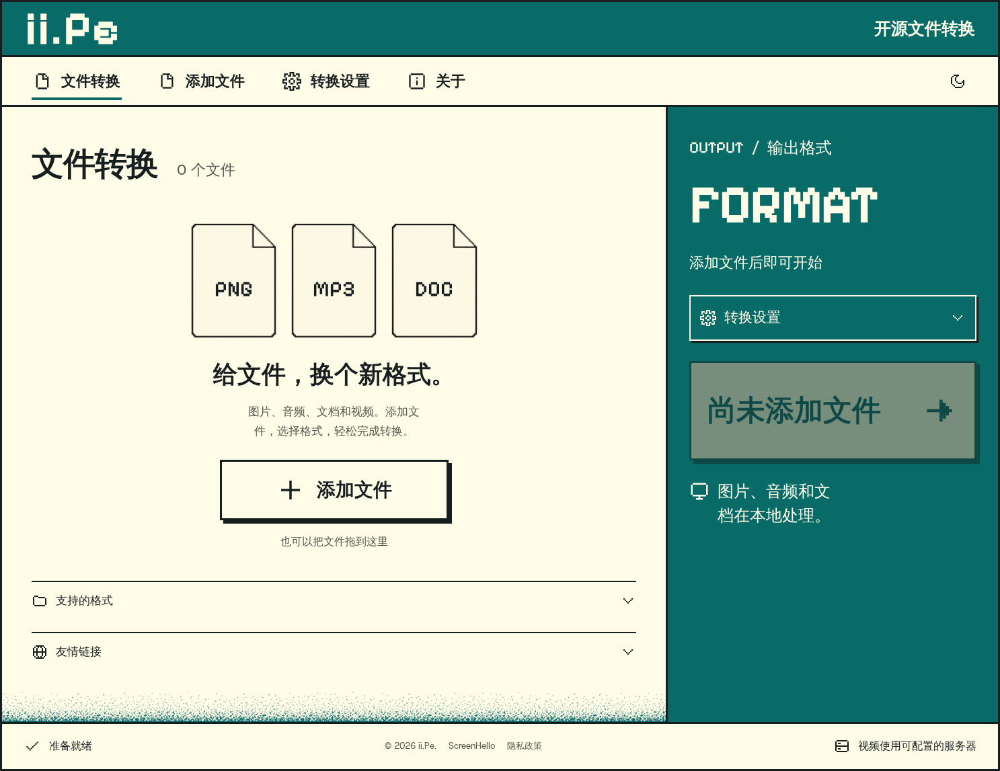
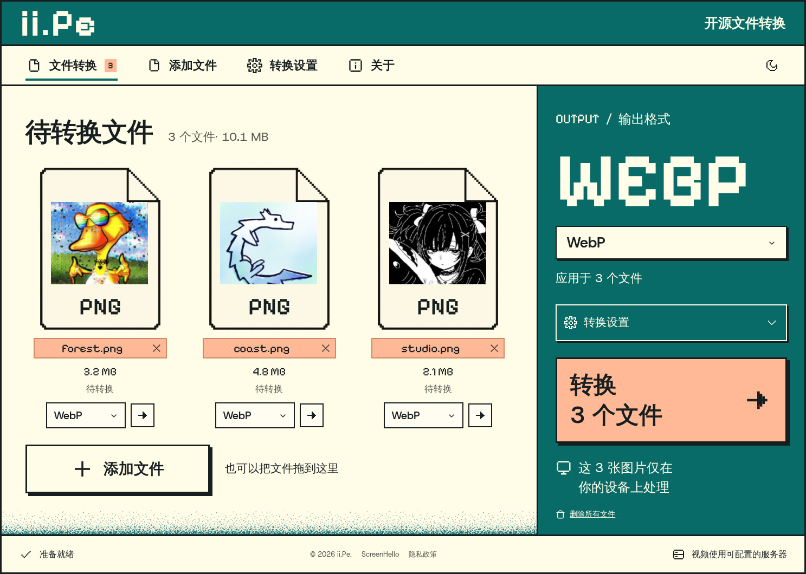

<h1 align="center"><a href="https://z8.work">Z8.Work</a></h1>

> **A zero-upload, browser-based file conversion tool.**

All image, audio, and document processing is done locally on your device, protecting your privacy. Files stay on your device; supported file sizes depend on browser memory, the local file buffer ceiling (just under 2 GiB), and the conversion engine.

The production domain is [z8.work](https://z8.work).

Source code and issue tracking: [web-casa/z8work](https://github.com/web-casa/z8work).

## Pixel Desktop interface

The homepage and conversion page share a responsive Pixel Desktop workspace with light and dark themes, per-file controls, batch conversion, cancellation, and reconversion. The archived screenshots below show the previous ii.Pe branding; the current site is Z8.Work.

| Homepage                                                                                                           | Conversion workspace                                                                                                |
| ------------------------------------------------------------------------------------------------------------------ | ------------------------------------------------------------------------------------------------------------------- |
|  |  |

See the [frontend redesign notes](docs/FRONTEND_REDESIGN.md) for the imported design, ii.Pe integration decisions, and validation records. Historical VERT concepts and screenshots are preserved in the [design archive](docs/design-exploration/README.md).

Current production branding, domain, icons and filename migration are documented in [Branding](docs/BRANDING.md).

## Why Z8.Work?

**File converters have always disappointed us.** They're ugly, riddled with ads, and most importantly; slow. We decided to solve this problem once and for all by making an alternative that solves all those problems, and more.

All files are converted completely on-device; this means that there's no delay between sending and receiving the files from a server, and we never get to snoop on the files you convert.

## Features

- **Privacy First**: The active converters process files on your device. This version does not load Google Analytics or send conversion telemetry. Resource downloads still make network requests.
- **Fully Local**: ImageMagick, FFmpeg, Pandoc and MuPDF run in your browser through WebAssembly. No remote video converter is enabled. The “File uploads: 0 B” indicator describes this local mode, not total browser network traffic.
- **PDF to Images**: Export PDF pages locally to 23 raster output extensions, including PNG, JPEG, WebP, AVIF, JPEG XL, GIF, TIFF and ICO, at 144 DPI. Download a single page directly or all pages in a numbered ZIP. Includes progress, cancellation and retry. See [support limits and validation](docs/fixes/pdf-to-images.md).
- **Languages**: Choose from 15 locales. The redesigned workspace, PDF, privacy and environment features are translated into English, Spanish, Simplified Chinese and Traditional Chinese. Other locales currently fall back to English for these features; translation coverage varies.
- **Browser Capacity**: There is no account quota; device memory and converter capabilities limit supported file sizes.
- **100% Free**: Completely **Open Source** and free forever. No annoying ads, no hidden paywalls, just **pure utility**.
- **Supported Conversions**: Images, audio, PDF pages and supported document formats, plus audio extraction from video. Available outputs depend on the converter; spreadsheets are not currently supported.
- **Resource Caching**: Conversion engines are served by this site and cached for reuse. Offline conversion requires the page and the required engine resources to be available locally; installing the PWA does not pre-download every engine.
- **Modern UI**: A stunning, **dark-mode optimized** interface designed for focus and **ease of use**.
- **Storage Impact**: Completed images show their actual size change and a conditional one-year storage CO₂ estimate. The [environment page](src/routes/environment/+page.svelte) explains the model, sources and limits; this is not measured or verified net emissions avoided.

Cloudflare Pages 的构建、引擎资源分发与验证方法，见[部署说明](docs/CLOUDFLARE_PAGES.md)。

多语言网址、转换工具入口、搜索收录范围和验证结果，见 [SEO 实施与审查记录](docs/SEO.md)。

## Acknowledgements

This project is a secondary development based on [VERT](https://github.com/VERT-sh/VERT). We would like to express our sincere gratitude to the VERT team for their open-source contribution and excellent foundation.

## License

This project is licensed under the AGPL-3.0 License, please see the [LICENSE](LICENSE) file for details.

工作区紧凑列表、手机固定操作栏、按范围重试与下载改进，见[实施与审查记录](docs/ux-optimization/IMPLEMENTATION.md)。

图片转换的位深、透明度、方向与颜色配置修复，以及真实样本的压缩结果，见[图片转换审查与验证](docs/fixes/image-output-fidelity.md)。

缩略图和 Worker 资源释放、FFmpeg 本地加载、隐私配置及 CI 改进，见[资源与隐私修复审查记录](docs/fixes/resource-privacy-review.md)。
