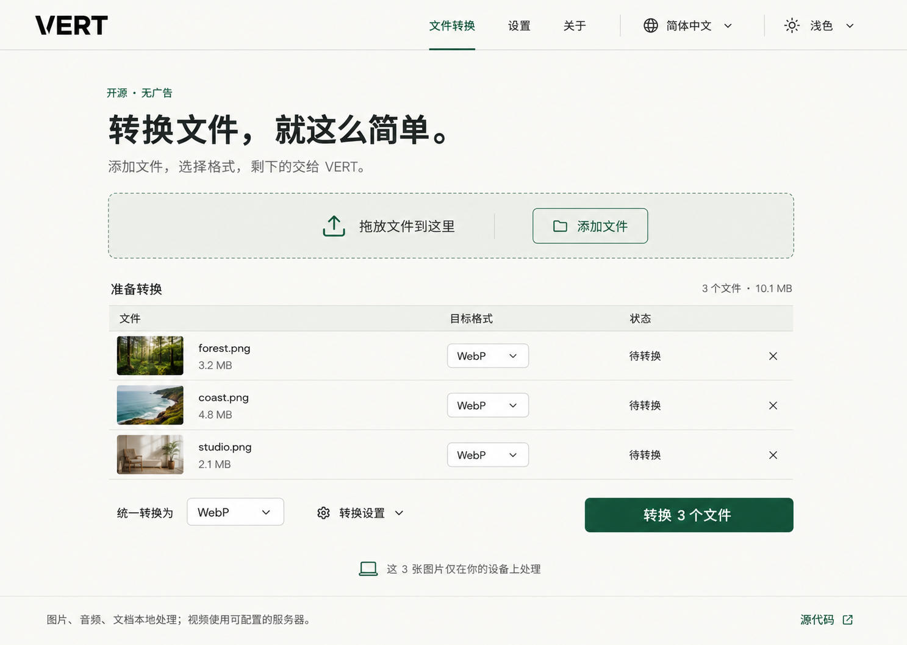
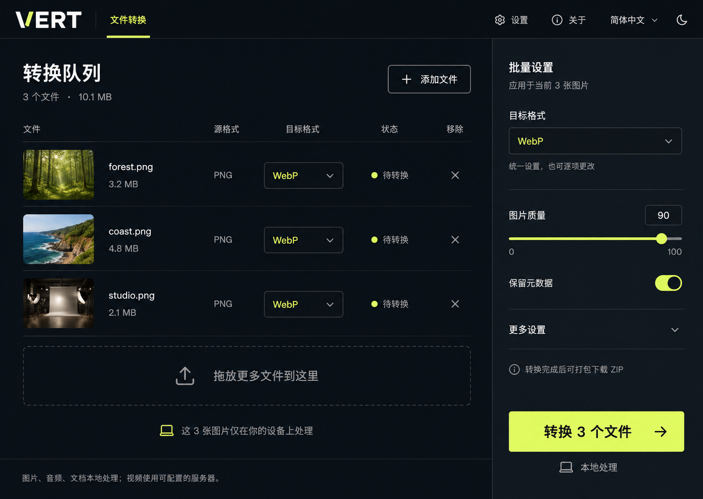
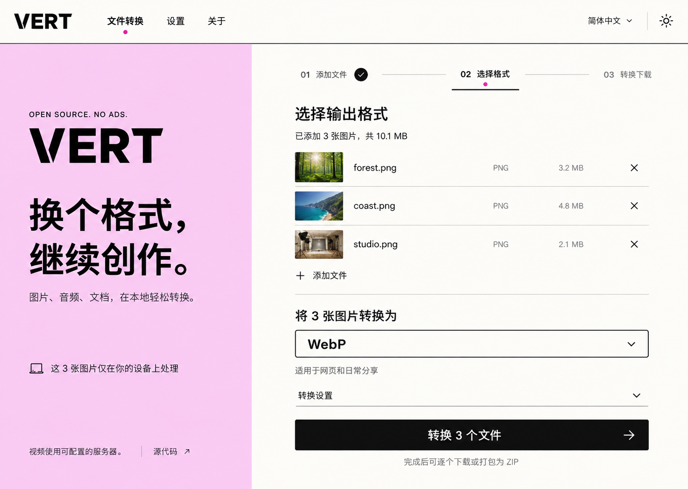

# VERT：设计探索索引与第一轮方案

日期：2026-09-06。范围：现有 VERT 桌面网页的核心文件转换流程。

目前已完成三轮共 11 个方案，并选用第三轮第 1 版 Pixel Desktop 实现前端。整体改造情况见 [前端改造说明](../FRONTEND_REDESIGN.md)，实现截图见 [Pixel Desktop 实现](pixel-implementation/README.md)。

探索历史：[第一轮 · 本页](#三版对比)、[第二轮 · 三版更大胆的设计方向](round-02-bold/README.md)、[第三轮 · 五版新设计方向](round-03-five/README.md)。以下保留第一轮分析与当时的验证边界。

第一轮交付为三张独立设计概念图及交互说明，该轮未实现前端。三张图均使用内置 ImageGen，实际附件为仓库的首页和转换页截图；未使用 CLI 图像生成。设计画布目标为 1440 × 1024，工具实际输出为 1487 × 1058，原图完整保存，未拉伸或裁切。

## 项目理解与依据

VERT 是开源文件转换工具。用户添加文件，选择输出格式，执行转换，最后逐个下载或打包下载 ZIP。图片、音频、文档主要在浏览器本地处理；视频默认经可配置的 vertd 服务处理，也可以连接自托管实例。

前端使用 Svelte 5、SvelteKit、TypeScript、Tailwind CSS 和 SCSS；图标使用 lucide-svelte；界面字体使用 Host Grotesk 和 Radio Canada Big。现有路由包括首页、转换、设置、关于和隐私，Paraglide 提供包含简体中文在内的多语言支持。

改造前的设计具有清楚的粉色品牌印象、悬浮胶囊导航、大圆角面板、文件类别颜色和明暗主题。原首页呈现上传入口与支持格式；原转换页用双列文件卡片展示预览、目标格式和单文件操作，上方提供批量操作。

阅读和查看的主要依据：

- [项目说明](../../README.md)、[视频处理说明](../VIDEO_CONVERSION.md)
- [现有首页截图](../images/screenshot-home.png)、[现有转换页截图](../images/screenshot-convert.png)
- [首页](../../src/routes/+page.svelte)、[转换页](../../src/routes/convert/+page.svelte)
- [上传组件](../../src/lib/components/functional/Uploader.svelte)、[批量操作](../../src/lib/components/functional/ConversionPanel.svelte)、[格式选择](../../src/lib/components/functional/FormatDropdown.svelte)
- [设置模型](../../src/lib/sections/settings/index.svelte.ts)、[转换设置](../../src/lib/sections/settings/Conversion.svelte)
- [全局样式](../../src/lib/css/app.scss)、[主题映射](../../tailwind.config.ts)

仓库截图是已有参考素材，并非本次运行捕获。下述问题来自源码和截图的设计评估，未进行浏览器操作测试、性能测试或完整无障碍审查。

## 重新设计的重点

| 现有表现与依据                                     | 设计处理                                               | 预期改善                         |
| -------------------------------------------------- | ------------------------------------------------------ | -------------------------------- |
| 首页四类格式长列表占据较多空间，列表还需要内部滚动 | 主区域聚焦文件操作；完整格式列表放到按需展开的帮助区域 | 降低初次使用的信息负担           |
| 转换页每个文件占一张较大卡片，上传卡片插入文件网格 | 文件使用连续列表；添加入口独立放置                     | 更容易对比文件、格式和状态       |
| 混合类型时“统一格式”显示禁用的 N/A                 | 明确说明无法统一设置的原因，并保留逐项选择             | 用户知道下一步如何处理           |
| 图片质量、元数据等参数在设置页面                   | 按方案使用就地展开区或侧栏呈现现有设置                 | 减少转换过程中的页面跳转         |
| 转换中的进度条占用了文件名位置                     | 持续显示文件名，另设状态区域                           | 用户在处理期间仍能识别文件       |
| 本地处理与视频服务器处理的说明不紧贴具体任务       | 按文件实际使用的转换器显示处理位置，视频显示所选实例   | 帮助用户在开始处理前判断数据去向 |

这些是待验证的设计判断，不代表已通过用户研究证明效率提升。

## 三版对比

三张图使用相同任务：forest.png（3.2 MB）、coast.png（4.8 MB）、studio.png（2.1 MB），共 10.1 MB，准备转换为 WebP。文件和缩略图是设计用示例，不是实际转换结果。编号与对话中生成图的显示顺序一致。

| 版本           | 视觉方向                           | 交互结构                         | 优先服务的场景                   | 主要取舍                                    |
| -------------- | ---------------------------------- | -------------------------------- | -------------------------------- | ------------------------------------------- |
| 1 · 轻量极简   | 暖白、深绿、留白、细分隔线         | 添加入口＋紧凑文件列表＋底部操作 | 偶尔使用、快速完成几份文件转换   | 默认隐藏高级参数，需要展开一次              |
| 2 · 专业工作台 | 深色、荧光黄绿、小圆角、清晰列对齐 | 文件队列＋常驻批量设置栏         | 高频使用、批量处理、经常调参数   | 初次进入的信息量较大，小屏需重排            |
| 3 · 鲜明编辑风 | 粉色、黑色大字、左右不对称分栏     | 品牌说明＋添加/格式/下载分步引导 | 初次使用、重视品牌辨识和过程指引 | 引导步骤增加操作切换，大队列效率不及第 2 版 |

### 1 · 轻量极简

界面把当前任务放在主页面上。空状态突出添加文件；添加后展开列表，保持同一工作区域的连续感。文件名、目标格式和状态始终对齐。质量和元数据设置按需展开，主按钮直接显示待处理数量。

移动端建议：标题缩至 28–32px，上传区缩为单行入口；每个文件改为上下两行，第一行显示缩略图和文件名，第二行显示格式和状态；主操作固定在底部并预留内容安全间距。格式列表在窄屏使用全宽选择面板。

### 2 · 专业工作台

文件队列占据主要宽度，侧栏直接显示统一格式、图片质量、元数据开关。当前模型中的质量和元数据是共享设置，界面需要明确适用范围，不暗示每个文件有独立质量设置。文件仍然可逐项更改格式。

移动端建议：取消常驻侧栏，改成主操作区上方的“批量设置”展开面板；保留文件名、源格式、目标格式和状态；按钮固定到底部。窄屏避免将桌面表格整体横向缩放。

### 3 · 鲜明编辑风

沿用粉色品牌印象，用平面色块和大字替代大面积渐变。右侧通过三步结构解释流程，当前处于“选择格式”，统一目标格式成为视觉焦点。返回“添加文件”应保留文件与已有选择；完成后进入“转换下载”，允许继续添加。

图中是同类型图片的简洁分支。混合图片、音频、文档时，应保留文件列表并提供逐项格式选择，不能强行套用图中的统一 WebP 控件。

移动端建议：左侧品牌栏收为简短页头，保留一句说明；步骤指示改成短标签，不重复大面积宣传内容；文件和格式控件单列布局，下一步操作固定到底部。

## 三版共用的交互约定

| 状态/情境            | 用户应看到的内容                                 | 操作与实现边界                                                           |
| -------------------- | ------------------------------------------------ | ------------------------------------------------------------------------ |
| 尚未添加文件         | 可点击的添加入口、拖放提示、简短处理位置说明     | 不显示空的格式下拉和不可用下载按钮；保留全页面拖放能力                   |
| 准备转换             | 文件名、输入格式、输出格式、状态和处理位置       | 同类且兼容时才允许统一格式；格式选项来自现有转换器能力                   |
| 转换组件准备中       | “正在准备图片转换功能”等文字与实际加载状态       | 相关开始按钮禁用，并说明原因；不能把正常下载组件显示成失败               |
| 转换进行中           | 文件名持续可见，每行显示状态                     | 仅转换器报告进度时显示百分比，否则显示不确定进度；取消复用现有能力       |
| 全部完成             | 每行下载入口、主操作变为 ZIP 下载                | 可继续添加文件；不展示尚未计算的节省比例或输出大小                       |
| 单文件失败           | 失败文件、原因、重试或移除入口                   | 保留其他结果；重试复用单文件转换能力，不声称已有“仅重试失败项”的批量接口 |
| 混合文件类型         | 每项独立选择格式，并说明统一设置不可用的原因     | 使用现有兼容条件，不能仅按扩展名猜测跨类型转换支持                       |
| 视频任务             | 当前服务器地址或实例名称、上传处理说明和连接状态 | 开始前让用户知道使用哪个实例；纯本地模式下遵循现有禁用外部请求配置       |
| 修改已完成文件的格式 | 目标格式更新，状态回到待转换                     | 按现有逻辑清除该项旧结果，避免下载旧格式                                 |
| 大文件与不支持的格式 | 明确的具体限制和处理建议                         | 依据当前设备及转换器能力，不承诺所有文件都不受大小限制                   |

移动端重排与这些状态是交互设计建议，当前三张图仅展示桌面准备转换状态，并未逐状态出图或实现。

## 视觉规格建议

| Token      | 轻量极简  | 专业工作台 | 鲜明编辑风 |
| ---------- | --------- | ---------- | ---------- |
| 页面背景   | `#F6F6F0` | `#11161C`  | `#FFFEF8`  |
| 次级表面   | `#E7EEE5` | `#191F27`  | `#F5CBEF`  |
| 正文       | `#202A25` | `#EDF3F8`  | `#191919`  |
| 主操作底色 | `#235B46` | `#D8F36A`  | `#191919`  |
| 主操作文字 | `#FFFFFF` | `#11161C`  | `#FFFEF8`  |
| 控件圆角   | 12px      | 6px        | 4px        |

以上是实施时的目标值，生成图像的像素颜色存在偏差。复用已有字体资源和图标库，中文配置合适的系统字体回退；正文建议 16px，辅助文字不小于 14px，交互区域建议至少 44px。状态同时使用文字与图标，不仅依靠颜色；键盘焦点应有清楚的可见描边，尊重现有动效开关及系统减少动画偏好。

## 后续落地边界与验证

现有转换器、文件状态、设置存储、翻译结构和隐私配置是重设计的基础。界面实现时复用现有能力，优先拆分文件行、任务操作区和设置展示组件；不为设计稿额外引入账户、历史记录、付费体系或新的转换服务。现有 `/`、`/convert`、`/settings`、`/about`、`/privacy` 链接应保持可访问。

本次已核对三张图的文件数、文件名、输入大小总和、目标格式、主操作、处理位置说明及明显裁切情况，验证了 PNG 完整性、三份文件内容互不相同和项目副本与原图一致。尚未验证实际转换、浏览器交互、键盘操作、屏幕阅读器、响应式布局和最终颜色对比度。

落地后应验证：添加与拖放、单文件与批量格式、混合类型禁用说明、转换器准备状态、开始/取消/失败重试、下载 ZIP、设置持久化，以及桌面与移动端的布局和键盘焦点。不以设计图本身替代这些检查。

如优先追求快速上手，可从第 1 版落地；如主要处理大量文件并频繁调参，可从第 2 版落地；如希望保留 VERT 原有视觉辨识并加强新用户引导，可从第 3 版落地。

## 文件

- `01-quiet-utility.png`：第 1 张独立概念图。
- `02-precision-desk.png`：第 2 张独立概念图。
- `03-vert-edition.png`：第 3 张独立概念图。
- `prompts.md`：三次内置 ImageGen 使用的完整提示词及参考图片路径。
