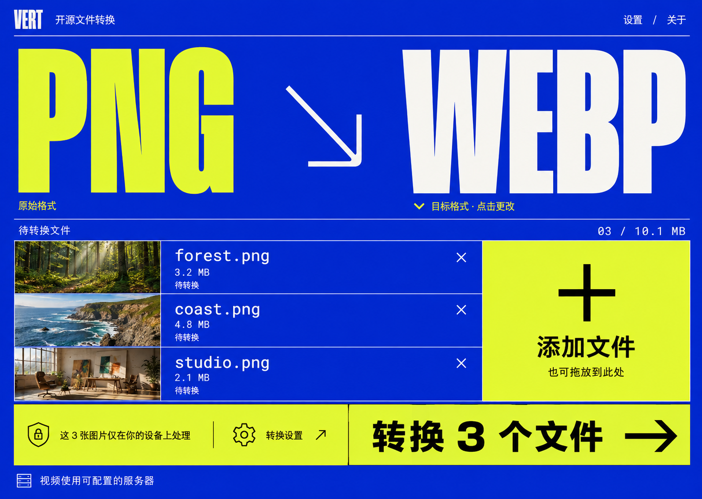
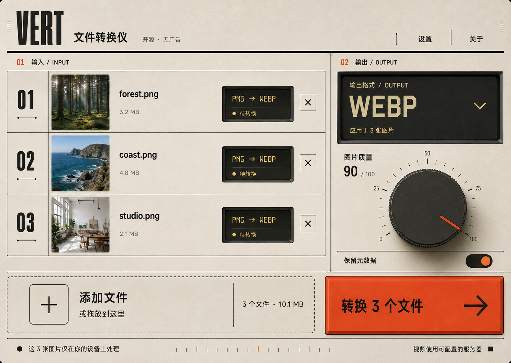
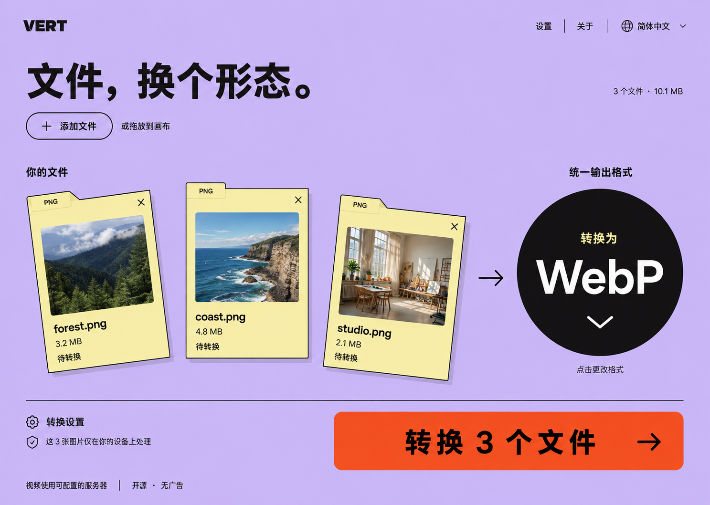

# VERT · 第二轮大胆设计探索

根据用户反馈，本轮进一步放大视觉差异，重新探索三种布局和交互呈现方式。三张图是独立替代方案，不是同一产品的三个页面；本轮探索时尚未开始前端实现。

后续已选用第三轮的 Pixel Desktop 并完成实现，见 [前端改造说明](../../FRONTEND_REDESIGN.md)。本页保留第二轮设计历史。

产品依据、实际功能和公共状态规则沿用[第一轮项目分析](../README.md)。生成时实际附加了仓库的[首页截图](../../images/screenshot-home.png)和[转换页截图](../../images/screenshot-convert.png)。使用内置 ImageGen 独立生成，完整提示词见 [prompts.md](prompts.md)。目标画布为 1440 × 1024；原始输出为 1487 × 1058，完整保存，未拉伸或裁切。

**本轮编号重新从 1 开始，与本轮对话中三张图片的显示顺序一致。**

## 方向对比

| 本轮版本       | 视觉特征                                           | 交互核心                                 | 最适合强调的产品气质             |
| -------------- | -------------------------------------------------- | ---------------------------------------- | -------------------------------- |
| 1 · 电光印刷   | 电光蓝、酸性黄、超大窄体字、硬边分区               | 超大的目标格式文字本身就是选择入口       | 强烈、直接、像可操作的设计海报   |
| 2 · 转换仪器   | 搪瓷底色、内嵌显示屏、质量旋钮、橙红启动键         | 文件通道与现有输出设置形成一台转换控制台 | 有触感、精密、具有工业设计记忆点 |
| 3 · 文件游乐场 | 淡紫画布、纸质文件对象、黑色圆形选择器、橙色主操作 | 用文件对象和输出目标表达转换关系         | 自由、轻松、接近创作工具         |

三版均使用相同示例任务：forest.png（3.2 MB）、coast.png（4.8 MB）、studio.png（2.1 MB），共 10.1 MB，准备转换成 WebP。图片、文件名和大小均为设计用示例，不是实际转换结果。

## 1 · 电光印刷

把输入和输出格式提升到海报标题的尺度。用户看到的最大文字就是正在做的事情；点击 WEBP 区域选择目标格式。左下的连续文件带展示实际输入，右侧大面积添加入口承接后续文件，底部整条行动区域完成转换。

落地细节：

- 格式文字必须是带明确标签的真实控件，支持键盘打开和可见焦点，不只是一段可点击标题。
- 长扩展名、不同文字长度与混合类型需要专门布局。混合输入可用“混合格式”替代 PNG，并恢复逐项输出设置；不能暗示任意类型都能转为 WebP。
- 大标题随屏宽缩放，并设置最小可读字号。移动端改为上下排列的输入与输出格式，文件列表保持单列。
- 转换中维持文件名，单独更新每行状态；全部完成后主行动切换为下载 ZIP。

取舍：品牌印象强，但大标题占用较多首屏空间；文件很多时应压缩标题高度，让队列成为主体。

## 2 · 转换仪器

每个文件像一个输入通道，小显示区表达 PNG → WebP 和当前状态。右侧用输出显示区、质量旋钮、元数据开关承接现有转换设置，大面积橙红按钮启动转换。材质和控制器造型参与功能表达。

落地细节：

- 质量旋钮是现有图片质量参数的新呈现方式，保留直接输入数字和标准滑块语义；方向键调整，触屏可通过上下拖动操作，不要求用户画圆。
- 旋钮必须显示当前值、范围、焦点和可用状态，不能仅依赖指针角度。元数据开关同样需要明确的开关状态文字或可访问标签。
- 单文件显示区应允许更改该项格式；全局输出区应用于当前兼容文件，不新增独立文件质量配置。
- 小屏将输出控制放在队列下方，缩小旋钮；质感纹理在正文区域降低强度，避免损害文字对比。
- 处理状态来自现有转换器。没有数值进度的任务使用不确定状态指示，不编造仪表读数。

取舍：控制器的操作反馈需要较精细实现；界面的拟物触感不应增加启动转换的步骤。

## 3 · 文件游乐场

文件以独立纸张对象出现在画布上，缩略图、文件名、大小和状态直接附着在对象上。右侧黑色圆形是格式选择器，下方橙色按钮是启动转换，两者通过文案与形状明确区分。

落地细节：

- 文件位置由响应式布局决定。画布是视觉组织方式，不表示增加自由拖拽布局、文件编辑或可保存的节点工作流。
- 图中轻微倾斜用于表达空间感；实施时保证删除按钮和名称的点击区域稳定，键盘顺序与文件顺序一致。
- 文件增加后按行排列，避免重叠；小屏取消倾斜并改为单列，缩小圆形格式控件。
- 混合类型时，每个文件对象提供自己的格式入口，统一输出区说明兼容限制。
- 转换中在文件对象内部显示进度或状态，完成后出现下载操作；动画不移动操作目标，并尊重减少动画设置。

取舍：少量文件时更有记忆点；大队列需要收紧对象间距、缩小预览，才能维持扫描效率。

## 共同边界与检查

三张图都保留了同一组真实功能边界：图片本地转换、可配置的视频服务器、添加文件、目标格式、转换操作。没有增加账户、付费、AI、云盘或新的后端接口。质量、元数据和转换状态继续复用现有模型；主题和语言入口可在设置中完整提供。

已目视检查生成图的文件数量、名称、大小总和、目标格式、主操作和处理位置文案，未发现主要操作被裁切。已验证三个 PNG 可完整解码、内容互不相同、项目副本与生成原图逐字节一致。

本轮是视觉探索，尚未验证浏览器交互、实际转换、键盘与屏幕阅读器、移动端和最终像素对比度。上述交互规则是实施要求，不能把静态设计图当作已经通过这些检查的证据。

## 文件

- `01-electric-press.png`
- `02-transcode-instrument.png`
- `03-file-playground.png`
- `prompts.md`
