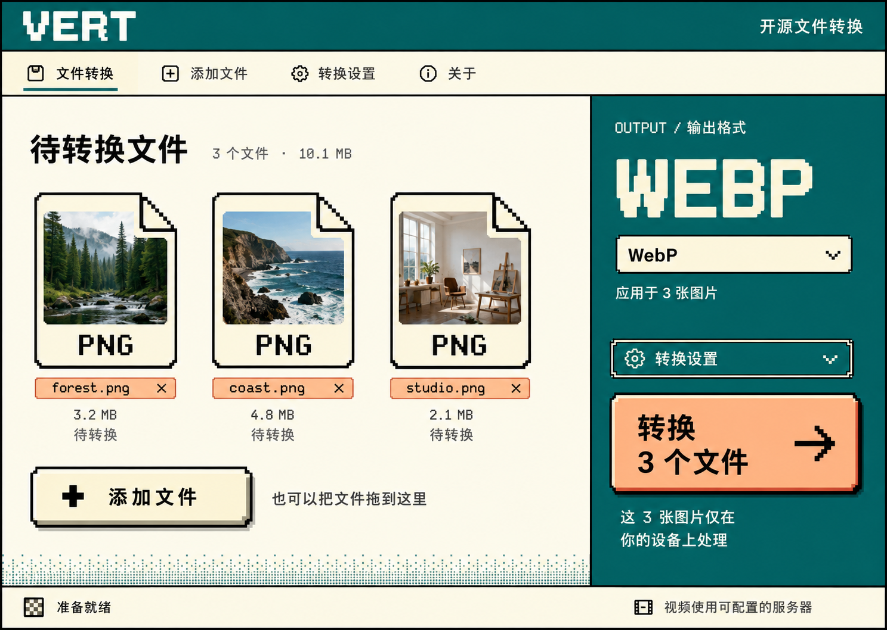
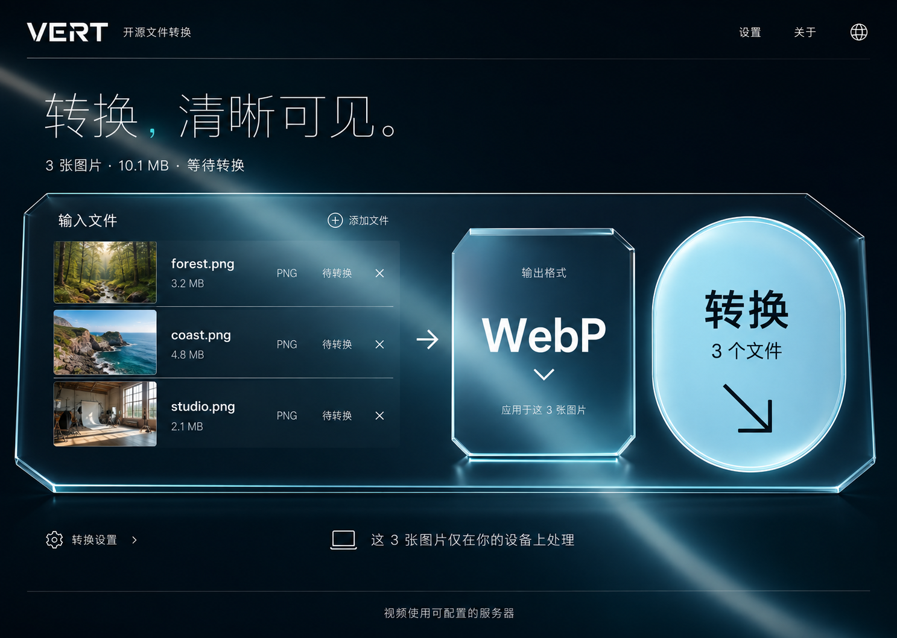
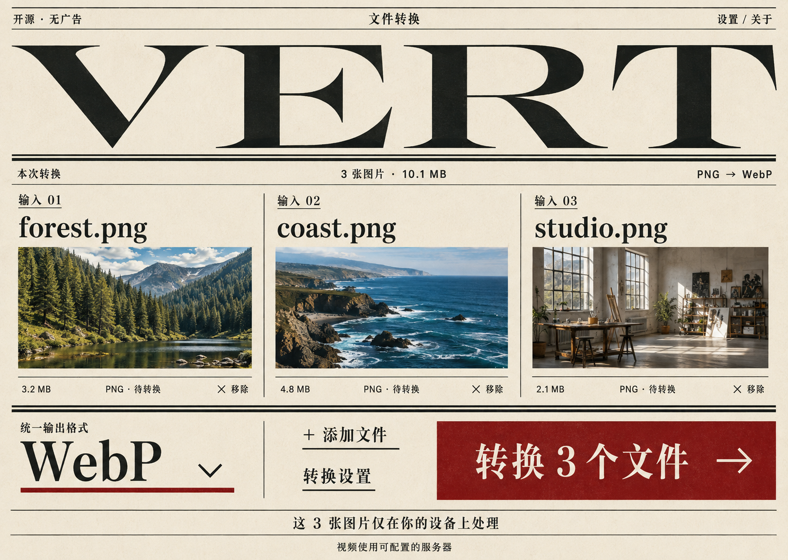
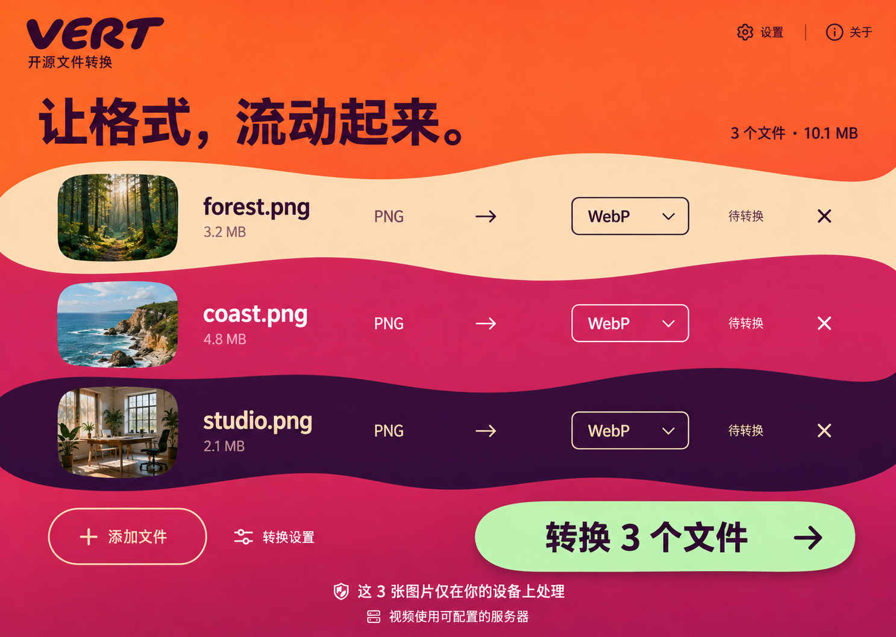
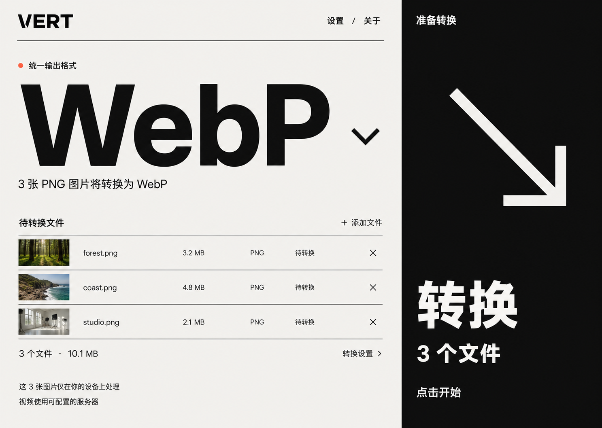

# VERT · 第三轮五版设计探索

本轮按用户要求继续探索五个版本，延续“更大胆”的方向。五张图是独立的视觉替代方案，不是同一方案的五个页面；本轮探索时交付桌面端概念设计。

最终选择第 1 版 [Pixel Desktop](01-pixel-desktop.png)，现已完成前端实现与两轮 review。详见 [实现截图](../pixel-implementation/README.md) 和 [前端改造说明](../../FRONTEND_REDESIGN.md)。以下保留五版探索时的设计说明与检查边界。

本轮编号从 1 到 5，对应本轮对话中的出图显示顺序。此前两轮的编号和图片不变。

## 设计依据

沿用[项目理解与业务约束](../README.md)，并在每次内置 ImageGen 调用中附加实际的[仓库首页截图](../../images/screenshot-home.png)与[转换页截图](../../images/screenshot-convert.png)。完整生成提示词见 [prompts.md](prompts.md)。此前的大胆方案见[第二轮](../round-02-bold/README.md)。

共同任务：forest.png（3.2 MB）、coast.png（4.8 MB）、studio.png（2.1 MB），共 10.1 MB，等待转换为 WebP。文件、图片和数值为设计示例，不是实际转换结果。五张图都保留图片本地处理和视频使用可配置服务器的说明。

目标画布为 1440 × 1024；工具实际输出为 1487 × 1058，原图完整保存，未拉伸、裁切或后期修改。

## 五版比较

| 本轮版本     | 视觉语言                         | 操作组织                       | 主要取舍                                       |
| ------------ | -------------------------------- | ------------------------------ | ---------------------------------------------- |
| 1 · 像素桌面 | 像素图标、硬边、青绿与奶油色     | 文件浏览区域＋输出控制区       | 复古识别强；需要控制像素字体的使用范围         |
| 2 · 透明叠层 | 冷色玻璃、折射边缘、横向空间层次 | 输入列表 → 格式选择 → 启动操作 | 材质鲜明；需验证文字对比与低性能设备表现       |
| 3 · 格式公报 | 报刊大标题、衬线字、纸色与暗红   | 文件分栏展示＋底部输出操作     | 图片比较直观；长文件名和大量文件需重新排版     |
| 4 · 流动色彩 | 橙色、莓红、紫色、连续曲线色带   | 每个色带是一项文件及其格式选择 | 动感强；需保持文字和操作位置稳定               |
| 5 · 巨型控件 | 黑白、大字号、整块主操作区       | 左侧任务设置＋右侧全高转换按钮 | 注意力集中；需验证主操作可识别性并防止重复提交 |

## 1 · 像素桌面

将文件以折角像素文档呈现，清晰显示内容缩略图、文件名、大小和待转换状态。输出区集中格式选择和开始操作，延续早期图形软件的直接感。

交互与适配建议：像素字体用于品牌和短标签，正文与中文使用清晰字体。输出大字是当前值展示，下方下拉框才是选择控件，不创建两个重复选择入口。保留单文件格式修改能力；混合类型时在各文件下显示对应选择器。窄屏将输出区放到文件区下方，文件对象按一列或两列排列，避免整体缩小桌面截图。

## 2 · 透明叠层

文件列表、输出格式和启动按钮横向排列。半透明表面与折射边缘表达空间层次；椭圆形主操作与切角格式选择区形成明显区别。

交互与适配建议：选择器、状态和文字均用真实界面元素实现；反射与折射效果只作用于背景或边缘。必须为不支持模糊效果、低性能设备及高对比偏好提供稳定的不透明表面。移动端将三个区域上下排列，降低玻璃边缘的视觉复杂度，主按钮改为水平形状。实施时适当提高细标题的字重，并验证最亮背景处的文字对比。

## 3 · 格式公报

以报纸版面呈现文件任务：VERT 作为报头，每个输入文件成为一个照片分栏，底部统一提供输出格式、添加入口、转换设置和主操作。

交互与适配建议：文件名称是真实任务信息，长名称允许换行或省略并提供完整名称访问方式，不能为维持报刊效果隐藏必要内容。小屏压缩报头并改单列。文件数量增加时延续分栏网格；批量操作保持可见。所有图片使用原文件缩略图，不能为了纸张风格改变用户需要识别的内容颜色。

## 4 · 流动色彩

用连续的色带作为文件行，每行同时呈现输入文件、目标格式和状态。转换关系直接写进文件行，适合逐项更改输出格式。主操作以薄荷绿色与暖色背景区分。

交互与适配建议：曲线边界是背景形状，文件名、按钮和菜单的点击区域保持水平且稳定。若加入缓慢形变，只动画背景，不移动文字和操作目标；尊重减少动画偏好。窄屏每项文件拆成上下两行，曲线幅度随宽度缩小。每条色带单独验证文字、下拉边框和焦点的对比度，不能用单一配色测试代替全页面检查。

## 5 · 巨型控件

以最大的文字突出目标格式，左侧保留紧凑文件清单；右侧整块黑色区域是唯一的转换按钮，其余区域不放置子按钮或导航。用极少元素形成强烈的操作焦点。

交互与适配建议：整块黑色区域需要真实按钮语义、明显的悬停和键盘焦点状态；显示“转换 3 个文件”，不能让箭头被误认为下载。任务启动后立即更新按钮状态并防止重复提交。文件准备未完成时需明确禁用原因。窄屏将其收为底部全宽按钮，不能继续占用大半屏幕。大号格式选择器必须容纳较长格式名，并按兼容条件处理混合类型。

## 共同实施约束

- 复用现有转换器、文件状态、格式兼容规则、设置存储和翻译结构，不为视觉造型创建新的后端能力。
- 图中同类图片可以统一格式；混合类型必须保留逐项选择，并解释统一设置的限制。
- 图片质量和元数据继续遵循现有共享设置，不暗示有独立文件质量参数。
- 转换进度只显示已有转换器能报告的值；失败、取消、逐个下载和 ZIP 下载按实际状态出现。
- 全页面拖放、文件选择、主题和语言等已有能力在实际实现中保持可用；图中未展开的设置并不表示删除功能。

## 检查范围

已目视查看五张原始输出，核对三个示例文件、大小总和、目标格式、待转换状态、主操作和处理位置说明，主要内容完整可见。已验证五张 PNG 的完整性、文件互不相同，以及项目副本与生成原图逐字节一致。

尚未进行浏览器实现、实际文件转换、移动端、性能、键盘、屏幕阅读器和最终像素对比度测试。以上适配说明是下一阶段的设计要求，静态图不代表已经实现或验证这些交互。

## 文件

- `01-pixel-desktop.png`
- `02-refract.png`
- `03-format-gazette.png`
- `04-chroma-flow.png`
- `05-monolith.png`
- `prompts.md`
