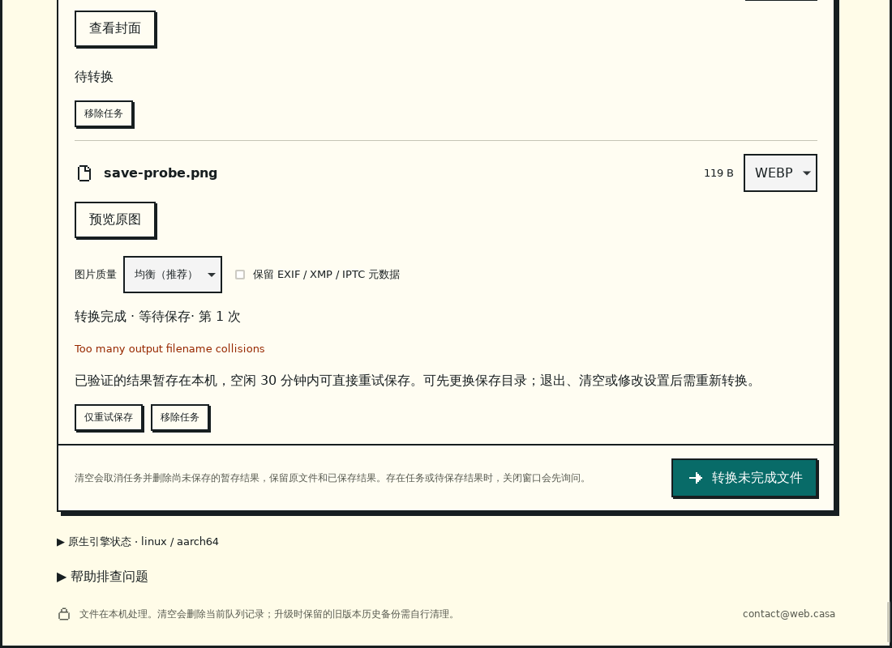
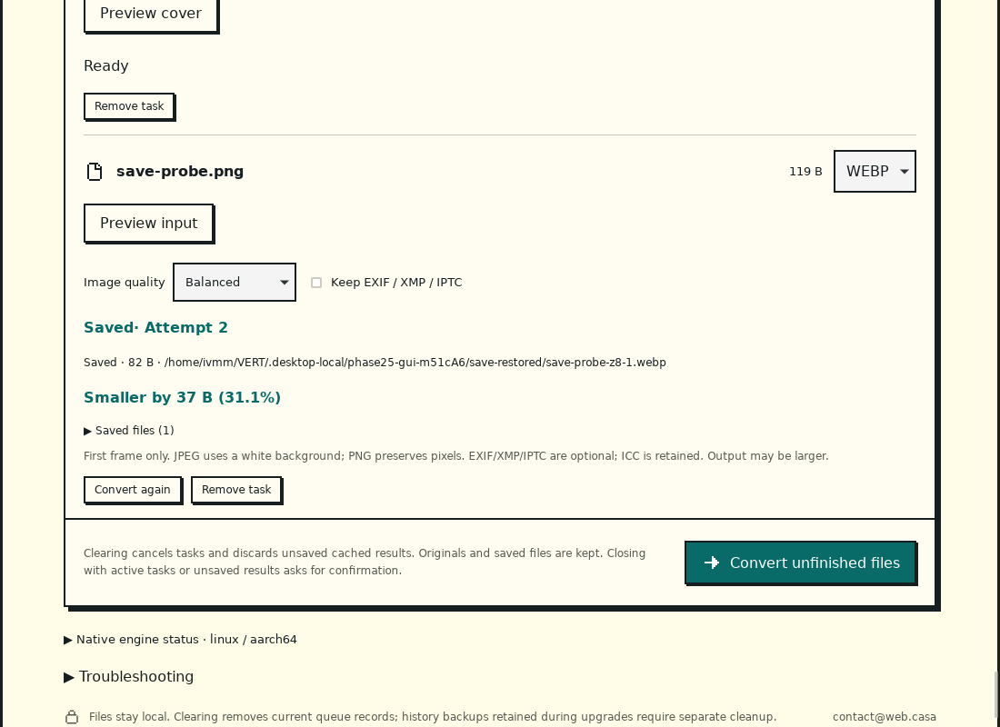

# Phase 25 / R2：转换结果保存恢复

日期：2026-09-09。**R2 开发、review、修复及 Linux ARM64 本机验证完成。** 已完成编码与验证的单文件结果，保存失败后可以更换输出目录并“仅重试保存”。不重新编码，也不要求再次读取源文件。本阶段没有增加格式、桌面 IPC 权限或发行渠道。

## 用户行为与边界

- 首次任务仍显示“转换、验证并保存中”。若编码验证成功但发布失败，进入“转换完成 · 等待保存”；点击“仅重试保存”进入“正在保存已有结果”，实际落盘后才成为“已保存”。失败或暂存结果不计入已保存体积。
- 更换目录使用已有原生选择器。取消选择保留现有授权和暂存；输出目录失效会撤销该目录授权，但保留有效暂存。只重试保存不读取原文件，即使原文件已经移走也可完成。
- 空闲有效期 **30 分钟**，合计 **1 GiB**，单结果沿用 **256 MiB** 上限。使用单调时钟；队列工作线程约每秒检查空闲过期，排队、保存与预览期间不抢先删除正在使用的文件。一次保存失败后重新开始空闲计时。
- 额度不足、工作目录空间预检失败或无法接管结果时明确提示需要重新转换。编码前的空间/权限预检失败没有可复用结果，仍使用普通重试。现有存储安全余量继续生效。
- 取消排队中的保存重试回到待保存。取消正在保存的操作保留有效暂存；若发布已经完成则报告已保存。移除/清空先取消并等待进行中的保存，再释放暂存；原文件与已保存文件不删除。
- 修改转换格式/参数使旧暂存失效，重复应用相同参数不清掉它。退出确认包含未保存结果，取消退出可继续保存；确认退出释放暂存。缓存仅本次进程会话有效。
- PDF 保持原有逐页发布、部分完成与未完成页重试，本次不暂存整份 PDF。网页实现保持原状。

## 实现

| 位置                                                                               | 职责                                                                                 |
| ---------------------------------------------------------------------------------- | ------------------------------------------------------------------------------------ |
| [retained.rs](../../src-tauri/native/src/retained.rs)                              | 私有结果工作目录、大小与 SHA-256、会话预算、保存调用；不反序列化路径或授权           |
| [convert.rs](../../src-tauri/native/src/convert.rs)                                | 验证后的发布失败交给暂存管理；复用禁止覆盖的发布函数，流式复制后校验大小和摘要再落盘 |
| [queue/mod.rs](../../src-tauri/native/src/queue/mod.rs)                            | 任务/轮次/参数绑定、仅保存请求、过期、取消/移除/退出同步与输出授权                   |
| [queue/store.rs](../../src-tauri/native/src/queue/store.rs)                        | 历史 schema 1/2 原字节备份后迁移至 3；重启待保存任务标为中断，不自动信任旧暂存       |
| [queue-contract.ts](../../desktop/src/platform/queue-contract.ts)                  | schema 2/3 兼容解析与 `save_only` 请求绑定，拒绝旧 schema 携带新状态                 |
| [App.svelte](../../desktop/src/App.svelte)、[quit.rs](../../src-tauri/src/quit.rs) | 双语状态、仅保存按钮、暂存说明与退出确认                                             |
| [desktop-save-retry-checks.mjs](../../scripts/lib/desktop-save-retry-checks.mjs)   | 真实引擎发布失败、更换原生目录、删除合成源文件后点击保存的桌面回归                   |

暂存只移动已验证的编码文件到同会话的独立私有工作目录，不保留暂存输入和引擎 scratch。文件大小及摘要由 Rust 持有，前端不能指定缓存路径。任务 ID、执行轮次、格式、参数一致才能保存；原有 request ID/epoch 机制保证重复提交不重复保存。

预算预约随结果最后一个 `Arc` 所有者释放，且排在工作目录清理之后；从任务表移除引用不会让正在读取的结果提前退还额度。文件删除在队列锁外执行，但保存与过期清理保留运行/清理标记，避免状态先完成、文件仍被另一操作使用。发布在用户已授权目录创建临时文件，跨文件系统复制，校验后使用禁止覆盖操作生成结果。

历史升至 schema 3，旧 schema 1/2 分别备份为 `v1-backup.json` / `v2-backup.json`；不同内容的已有备份不会覆盖。新历史不保存可恢复的缓存句柄；重启恢复任务说明与历史结果，所有输入/输出授权重新获取，不自动重跑。旧版本不应直接读取新历史，回退应用和回退历史须分别处理。

## Review 与修复

| 发现                                                 | 修复与复测                                                                        |
| ---------------------------------------------------- | --------------------------------------------------------------------------------- |
| 释放任务表引用可能提前退还额度，而保存线程仍持有文件 | 将额度预约放到结果所有权中；验证最后引用释放前额度仍占用                          |
| 过期任务已显示失败时文件还未删除，故障测试实际失败   | 清理标记覆盖锁外删除，完成删除后再发布过期状态；新增断言及完整原生复测通过        |
| 锁外删除后使用旧 journal 副本可能覆盖并发取消        | 重新取得锁后读取当前 journal 再写终态；运行中移除、排队保存取消回归通过           |
| 相同设置重复应用也会清掉有效结果                     | 仅实际格式/参数变化使暂存失效，加入回归                                           |
| 跨目录保存脚本以旧目录授权状态判断选择完成           | 改为检查原生选择窗口是否仍存在；真实更换目录及取消路径通过                        |
| 新测试假设提交顺序等于队列执行顺序，首次失败         | 按现有 journal 顺序安排受控阻塞 fixture，不改变产品调度规则；重新运行通过         |
| 新回调触发 Clippy 类型复杂度检查，开发 smoke 漏字段  | 引入 `Retainer` 别名并补齐 `save_only: false`；app/native 编译、测试、Clippy 通过 |

复核覆盖授权与缓存身份、禁止覆盖、校验后发布、额度所有权、锁外 IO、取消/退出竞态、历史迁移及文案边界。本阶段未发现仍需阻止交付的代码缺陷。原始失败日志与最终通过日志分别保存，不用通过结果覆盖失败过程。

## 验证

| 检查                                                         | 结果与实际边界                                                                                                                                     |
| ------------------------------------------------------------ | -------------------------------------------------------------------------------------------------------------------------------------------------- |
| Rust native，无默认 feature                                  | 102 通过、3 ignored；其中 2 项为既有子进程 fixture，1 项为单独执行的压力检查                                                                       |
| Rust native，development-engines                             | 101 通过、3 ignored                                                                                                                                |
| Tauri app 单元测试                                           | 7 通过                                                                                                                                             |
| Node 22.22.2 / 24.18.0 桌面测试                              | 各 156 通过，含 schema 和保存请求契约                                                                                                              |
| Svelte 检查、前端构建、Linux app 构建                        | 通过；Svelte 0 errors / 0 warnings，依赖工具仍提示浏览器兼容数据过期                                                                               |
| rustfmt、Clippy、相关 ESLint/Prettier                        | 通过                                                                                                                                               |
| Windows x64 / macOS ARM64 原生核心交叉检查                   | 通过；包括测试目标，不是相应系统上的 app/GUI/安装验收                                                                                              |
| Linux ARM64 真实 GUI                                         | 最终代码 67 项检查、20 条预览/输入样本路线通过；包含此前 PDF、音频、导入、工作目录、存储与诊断回归，不代表首版声明的 84 条转换路线全部完成质量验收 |
| 1 GiB 暂存压力                                               | 单独执行通过：4 个 256 MiB 稀疏逻辑输出，拒绝额外结果，释放后可再次预约；不是填满磁盘测试                                                          |
| Windows/macOS 原生 GUI、AMD64 strict Snap、三端安装及远端 CI | 未执行，仍属后续阶段门槛                                                                                                                           |

原生测试用执行次数证明保存重试仅调用一次编码器，并覆盖取消、幂等、输入删除、输出目录消失与重选、过期、同大小篡改、文件丢失、参数变化、移除/退出和 schema 迁移。Linux 跨盘测试确认工作目录和 `/dev/shm` 的设备不同，实际复制结果且字节一致。

真实 GUI 使用合成 PNG 和 1,000 个已有同名文件，触发实际 WebP 编码成功后的发布失败。关闭确认按 Escape、取消输出选择后仍有暂存；删除合成源文件，再用原生选择器改目录并点击“仅重试保存”，成功产生真实 WebP 文件，原有 1,000 个文件均未变化。没有使用用户图片。





最终环境、源码与二进制摘要见[验证摘要](evidence/phase25/verification.json)；[源码输入收据](evidence/phase25/inputs.json)、[GUI 报告](evidence/phase25/gui-report.json)、[压力计量](evidence/phase25/cache-pressure.json)及[完整证据清单](evidence/phase25/inventory.json)分别记录。实现已提交为 `15a8a82c260749cf59f890aafd02b95b192f0933`；[提交后收据](evidence/phase25/inputs-committed.json)与测试时 372 个输入文件的字节及摘要全部一致。测试源码收据包含当时 HEAD 和实际工作区文件摘要，文档归档另记，不以单独的旧 HEAD 冒充最终测试代码。

## 复现

```bash
bun run desktop:check
bun run desktop:test:ui
bun run desktop:build
cargo test --locked --manifest-path src-tauri/Cargo.toml -p z8-native --no-default-features
cargo test --locked --manifest-path src-tauri/Cargo.toml -p z8-native --features development-engines
cargo test --locked --manifest-path src-tauri/Cargo.toml -p z8-desktop --features development-engines,custom-protocol
cargo clippy --locked --manifest-path src-tauri/Cargo.toml --all-targets --features development-engines,custom-protocol -- -D warnings
cargo test --locked --manifest-path src-tauri/Cargo.toml -p z8-native --no-default-features one_gib_cache_budget_is_enforced_and_released -- --ignored --nocapture
cargo build --locked --manifest-path src-tauri/Cargo.toml --features development-engines,custom-protocol
```

原生 GUI 需要 Linux WebKitGTK、Xvfb、D-Bus、tauri-driver、WebKitWebDriver、xdotool，以及可用的原生引擎清单。设置本机 `Z8_DEV_ENGINE_MANIFEST`、必要时设置 `Z8_XDOTOOL` 与 `Z8_XDOTOOL_LIBRARY_DIR` 后运行：

```bash
xvfb-run -a --server-args='-screen 0 1280x900x24' dbus-run-session -- bun run desktop:test:save-retry
```

本机因共享 `/tmp` inode 紧张，设置 `TMPDIR` 到 `.desktop-local/phase25/tmp`；没有清除共享临时目录。此开发构建使用本机引擎，不作为自包含发行包。

## 剩余限制与下一阶段

预算约束本会话已接管的编码结果，不是全局文件系统配额。异常终止或系统拒绝删除时，已拥有的会话残留仍依赖已有工作目录恢复清理机制；不扫描用户输出目录。压力检查使用稀疏文件，计量是 Cargo/测试子进程的最大 RSS，不是 GUI 峰值内存，也不替代真实受限磁盘、断盘或睡眠恢复验收。流式复制有取消和超时检查，但内核阻塞 IO 不能被该检查强行打断；真实平台故障仍需 R6 执行。

下一阶段为 **R3 / Phase 26：启动、早期导入、进度和稳定错误分类**。目前仍沿用字符串错误和同步引擎初始化，部分原有引擎/发布错误仍显示英文；本阶段只补新状态及暂存提示的双语，完整错误分类与文案覆盖继续由 R3/R4 完成。Windows/MSIX、AMD64 strict Snap、macOS 原生环境、候选许可与正式身份缺项继续按 R5–R7 追踪；本轮只整理本地提交，没有推送或上架。
