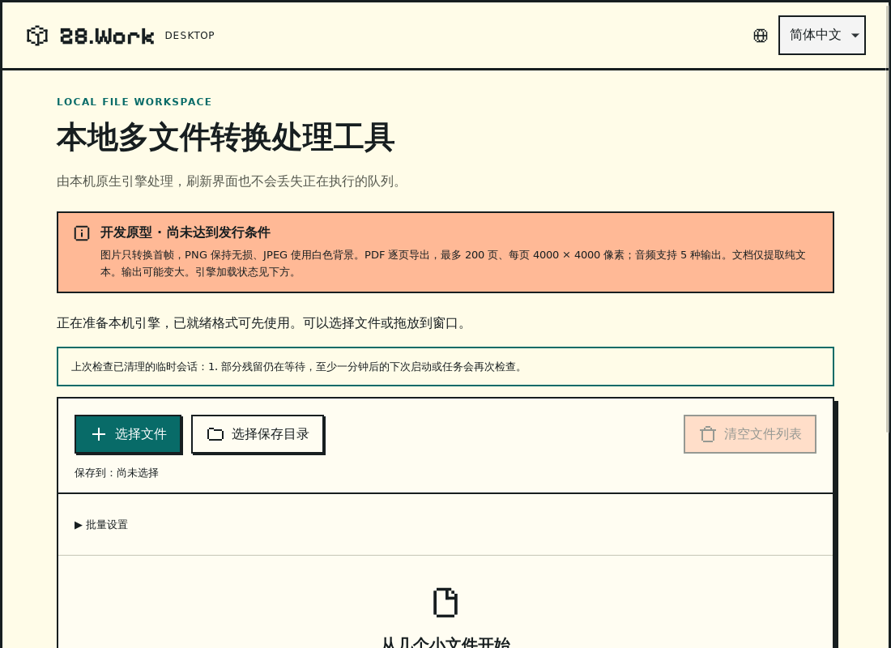
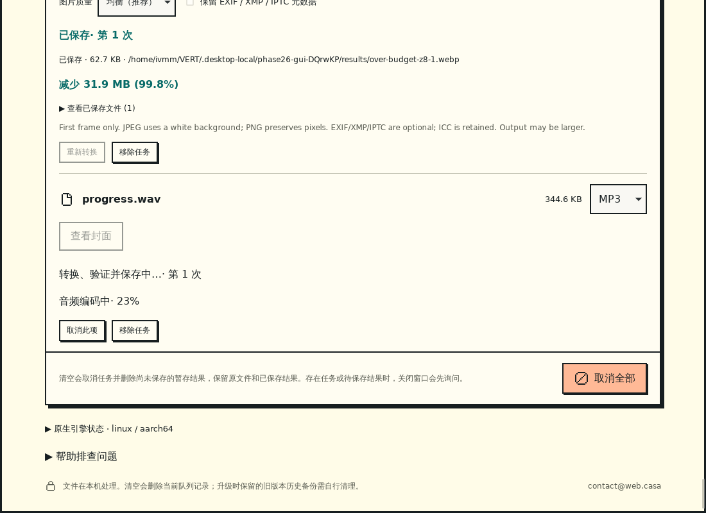

# Phase 26 / R3：后台启动、导入、进度与错误

日期：2026-09-09。**R3 开发、review、修复及 Linux ARM64 本机验证完成。**本阶段接续 [Phase 25 保存恢复](PHASE25_IMPLEMENTATION.md)，完成窗口显示与原生准备解耦、启动期文件接收、音频进度及稳定错误分类，不增加格式和发行渠道。

## 交付与行为

- 首屏可以先显示，偏好和语言切换独立加载。原生引擎显示准备中、就绪或失败；某个引擎的版本探测阻塞或失败，不阻止其他已就绪类别使用。任务需要的引擎未就绪时显示准备提示，不将支持的输入误判为不支持。
- 工作目录恢复、队列历史加载与引擎探测在后台线程运行。队列快照、目录建议、选择后的登记与输出授权操作不在窗口事件线程执行。
- 选择器和拖放沿用 OS 提供的路径，没有接受任意输入路径的新 IPC。后台收件队列最多持有 100 个路径（包含正在登记的一批），超过限制明确拒绝新增；现有任务总数仍为 100，文件大小、类型和恢复授权由原队列校验。
- 早期文件只登记为待转换，不自动转换。界面通过快照重连获取结果；选择器关闭后，命令等到登记完成才返回。选择、拖放与退出共享现有生命周期限制。单实例第二次启动仍只聚焦窗口，不把命令行参数导入为文件。
- FFmpeg 音频编码显示可测量的编码百分比，随后显示验证和保存阶段。`progress=end` 不代表文件已保存；编码百分比最多 99%，只有原有发布校验成功才显示已保存。PDF 保留原有页进度；图片、文档不伪造百分比。
- 新状态与错误分类具有中英文提示。暂存保存仍不读取输入、不调用引擎；引擎准备状态不会禁用“仅重试保存”。

## 架构与限制

| 实现                                                                                                       | 职责                                                                         |
| ---------------------------------------------------------------------------------------------------------- | ---------------------------------------------------------------------------- |
| [startup.rs](../../src-tauri/native/src/startup.rs)                                                        | 五个引擎独立状态、后台检查、取消和退出；只把就绪引擎合入可执行集合           |
| [boot.rs](../../src-tauri/src/boot.rs)                                                                     | 工作目录/队列异步初始化，有限原生收件队列，一次登记和关闭收敛                |
| [main.rs](../../src-tauri/src/main.rs)                                                                     | 原生交互、后台命令与启动事件接线，退出时取消并等待后台工作                   |
| [progress.rs](../../src-tauri/native/src/progress.rs)、[process.rs](../../src-tauri/native/src/process.rs) | 从监督进程 stdout 按块解析机器进度，限制单行、频率和字段，不转发原始进度文本 |
| [queue/mod.rs](../../src-tauri/native/src/queue/mod.rs)                                                    | 暂态进度绑定任务和轮次，复用 revision 通知与权威快照，结束后清空             |
| [failure.rs](../../src-tauri/native/src/failure.rs)、[runtime.ts](../../desktop/src/platform/runtime.ts)   | 稳定公共错误枚举、双语展示与逐类引擎就绪判断                                 |
| [runtime-contract.json](../../desktop/tests/fixtures/runtime-contract.json)                                | Rust/TypeScript 共用的错误、引擎状态与进度阶段词汇，防止两端漂移             |

开发引擎分别读取有大小限制的清单并验证文件摘要，每个准备任务总计 30 秒，子进程版本探测最多 10 秒；按文件块检查取消与截止时间。正式包继续先验证整个共享资源清单，最多 120 秒，再并行探测五个引擎。**损坏的共享清单或资源完整性失败仍会阻止整个包使用**，不会为局部可用而跳过原有安全检查；单个引擎运行失败才隔离到对应类别。此阶段没有完成新发行包验收。

退出会阻止新接收、停止队列、取消引擎准备并等待后台线程。启动期已有文件等待登记时也会走退出确认。文件系统操作移出了事件线程，但底层系统调用卡住时不能靠 Rust 取消标记强制中断；引擎子进程继续由已有 watchdog/Windows Job 管理。真实断盘、睡眠恢复和平台安装故障留给 R6，不能把本机普通磁盘检查等同于这些验收。

FFmpeg 使用 `-progress pipe:1 -nostats -stats_period 0.25`，按官方机器进度接口读取 `out_time_us` 和进度块。解析器最多保存 256 字节一行、最多每 250 毫秒发布一次、丢弃未知字段与非法数字；百分比不倒退。stdout/stderr 仍各保留已有有限尾部，不随输入无限增长。[FFmpeg 官方参数说明](https://ffmpeg.org/ffmpeg.html)

进度只存在内存快照，不每次写入历史；仍增加同一队列 revision，重连和旧响应排序沿用现有机制。回调必须匹配运行中任务及 attempt，取消/清理/退出后拒绝更新。新快照字段可选且为空时不序列化，历史 schema 3 不变，旧 schema 2 快照仍可解析；旧任务历史按 Phase 25 规则迁移。诊断仍采用原有白名单，不加入文件路径、原始日志或百分比文本。

开发模式的 PDF 结果指纹只依赖 ImageMagick/MuPDF，其他引擎稍后就绪不会使部分完成页失效；正式包继续绑定完整包身份。旧开发版采用全引擎指纹，升级后可能保守地重新导出旧部分任务，原有文件仍保留且不覆盖。

错误分类覆盖准备、引擎不可用、取消、超时、输入、导入数量、暂存过期/损坏/额度、存储、目录写入、发布、转换、历史和退出。分类只携带枚举值，没有路径或任意文本参数。旧 Rust `String` 错误通过兼容层逐步分类，**并未把所有内部函数一次性改成类型化错误**。原始历史错误仍用于后端排错，任务/预览 UI 使用受控文案；未知错误显示通用处理失败，不把引擎日志直接放到页面。

## Review 与修复

| 发现                                                | 修复与验证                                                                         |
| --------------------------------------------------- | ---------------------------------------------------------------------------------- |
| 同步 setup 执行摘要、工作目录恢复和历史 IO          | 分离引擎准备和后台服务初始化；阻塞探测期间验证首屏、语言和选择器可用               |
| 以当前引擎可用列表判断早期输入，可能误报不支持      | 登记沿用静态格式范围，提交和执行按实际所需引擎检查；就绪/失败按类别提示            |
| 异步准备期间退出可能遗漏等待登记的文件              | 原生收件数量参与退出判断，确认后先关闭接收，停止队列与探测，再等待后台退出         |
| 清单读取先全量读文件、摘要过程不检查取消            | 开发清单按 64 KiB 限读，包清单维持 2 MiB 上限；摘要分块检查取消、时限和文件增长    |
| 新可选字段使旧快照序列化契约测试失败                | 空进度和空错误映射不序列化，保留旧 fixture 原字节结构；复测通过                    |
| 进度尾部与旧轮次事件可能误示完成                    | 只解析机器字段，限频/限长、绑定 attempt、终态清空，100% 不用于编码阶段             |
| 首次目录选择落入 GTK Recent，自动化未能确认键入目录 | 无历史建议时原生选择器从主目录开始；脚本等待原生登记完成，目录选择实际复测         |
| 新 GUI 测试提前转换，污染旧用例的初始授权和清理状态 | 先验证启动清理与无输出授权路径，再执行音频进度；移除仅本次测试任务，不放宽旧断言   |
| 引擎错误中可能包含路径、长日志与 HTML 样式文本      | 公共错误仅枚举，UI 不回显未知引擎文本；Rust/TS 共用 fixture 验证词汇和拒绝非法载荷 |
| 共享格式依赖映射可能产生两份 Rust 规则              | `Engines::formats_for` 与启动运行时复用同一依赖函数，原有首版矩阵测试继续核对      |

补充 review 修复：开发模式 PDF 指纹不再受无关引擎准备顺序影响；回归测试验证新增 FFmpeg 不改变指纹，改变 ImageMagick 身份则必须改变指纹。类型检查发现嵌套回调中的数组收窄失效，改用已验证数组的局部引用后，类型检查和两版 Node 测试通过。

## 验证与证据

| 检查                                                         | 结果与边界                                                        |
| ------------------------------------------------------------ | ----------------------------------------------------------------- |
| 原生核心，无默认 feature                                     | 109 通过、3 ignored                                               |
| 原生核心，development-engines                                | 108 通过、3 ignored                                               |
| Tauri app 单元测试                                           | 9 通过                                                            |
| Node 22.22.2 / 24.18.0                                       | 各 160 项通过                                                     |
| Svelte、前端和 Linux app 构建                                | 通过；0 errors / 0 warnings，依赖工具仍有浏览器数据过期提示       |
| Clippy、rustfmt、相关 ESLint/Prettier                        | 通过                                                              |
| Windows x64 / macOS ARM64 核心交叉检查                       | 通过；包含测试目标，不是相应系统上的 app/GUI/安装验收             |
| Linux ARM64 真实 GUI                                         | 最终源码 73 项检查、20 条样本路线通过；不是全部首版格式的质量冻结 |
| 1 GiB 暂存逻辑压力复测                                       | 单独执行通过，约 42 秒；稀疏输出，不是填满磁盘或 GUI 峰值内存测试 |
| Windows/macOS 原生 GUI、AMD64 strict Snap、三端安装、远端 CI | 未执行，保持后续门槛                                              |

三个 ignored 包含两个既有子进程 fixture 及单独执行的暂存压力用例。原生关闭在版本探测被阻塞时约 **114 毫秒**完成，低于本机 smoke 的 4 秒断言；这是一次 Linux 观察值，不是跨平台性能承诺。

实现提交为 `8ec7043a6fc22ded0cc39a952e478b3fb84f0ef2`。[测试输入收据](evidence/phase26/inputs.json)与[提交后收据](evidence/phase26/inputs-committed.json)的 **380 个文件**摘要一致。GUI 运行于提交前已构建的同一工作区代码，文档随后单独归档；没有声称隔离 checkout 或远端 CI 已重新执行。

[完整验证与二进制摘要](evidence/phase26/verification.json)、[GUI 报告](evidence/phase26/gui-report.json)、[关闭耗时](evidence/phase26/startup-exit.json)、[真实进度采样](evidence/phase26/progress-samples.json)及[证据文件清单](evidence/phase26/inventory.json)保留原始结果。先前失败日志也保留；中间检查报告中的类型失败由后续成功日志说明，不覆写失败证据。





新增原生测试覆盖阻塞/失败引擎隔离与取消、有限早期导入和只登记一次、解析器异常/超长/分块/倒退/节流/未知时长、旧轮次回调、错误脱敏及双端契约。原有历史迁移、诊断、保存恢复、PDF、取消与进程树测试继续执行。

真实桌面回归使用合成文件及测试专用开发清单：只阻塞 ImageMagick 的 `-version` 探测，真实其他引擎先就绪；释放后恢复原引擎行为。音频用真实 FFmpeg 的受控实时读取生成可观察进度，不向生产程序添加测试 IPC 或测试环境开关。再次启动时阻塞探测，发送原生关闭事件验证取消退出。完整回归包含 Phase 25 的保存重试与之前的预览/导入/诊断路径。

## 复现

```bash
bun run desktop:check
bun run desktop:test:ui
bun run desktop:build
cargo test --locked --manifest-path src-tauri/Cargo.toml -p z8-native --no-default-features
cargo test --locked --manifest-path src-tauri/Cargo.toml -p z8-native --features development-engines
cargo test --locked --manifest-path src-tauri/Cargo.toml -p z8-desktop --features development-engines,custom-protocol
cargo clippy --locked --manifest-path src-tauri/Cargo.toml --workspace --all-targets --features development-engines,custom-protocol -- -D warnings
cargo build --locked --manifest-path src-tauri/Cargo.toml --features development-engines,custom-protocol
```

设置真实的 `Z8_DEV_ENGINE_MANIFEST`、`Z8_XDOTOOL`、必要时 `Z8_XDOTOOL_LIBRARY_DIR`；Linux 安装 WebKitGTK、tauri-driver、WebKitWebDriver、Xvfb、D-Bus 和原生引擎后运行：

```bash
xvfb-run -a --server-args='-screen 0 1280x900x24' dbus-run-session -- bun run desktop:test:startup
```

本机以 `.desktop-local/phase26/tmp` 作为 `TMPDIR`，未清理共享临时目录。正式安装件关闭开发清单覆盖，此处的测试 wrapper 仅作为本机故障夹具。

## 下一阶段

R4 / Phase 27：首版产品体验与格式质量冻结，继续完整双语、像素细节、隐私/环保说明、真实格式质量与可访问性。跨平台候选、安装、许可及商店身份缺项仍按 R5–R7 追踪，本轮不推送或发布。
