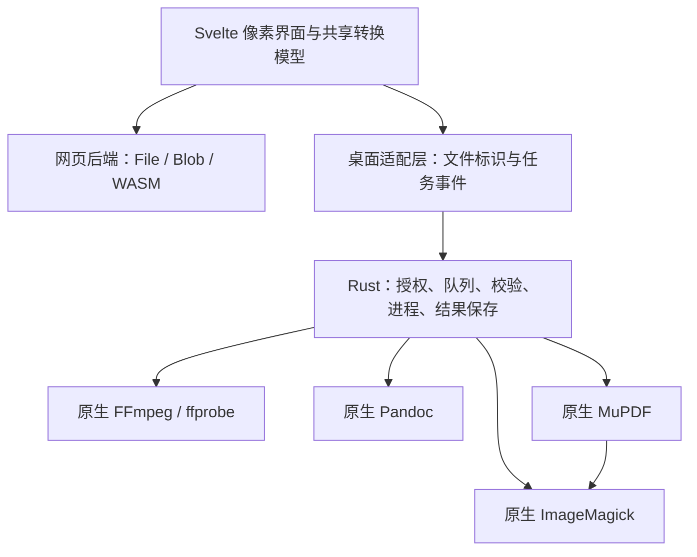

# Z8.Work 桌面版 V1 开发方案：原生转换引擎

**2026-09-09 剩余工作重排：[七阶段执行方案 R1–R7 / Phase 24–30](REMAINING_V1_PLAN.md)**，附[自审与修正记录](REMAINING_V1_REVIEW.md)。后续开发顺序和明确的首版格式/语言范围以该方案为准；本文保留原始架构、安全约束与研究依据，早期验收状态不表示当前源码已通过对应平台验证。

[Phase 24 / R1](PHASE24_IMPLEMENTATION.md)已完成首版能力与源码基线、CI/收据修正、隔离 checkout 验证及[平台条件清点](PHASE24_READINESS.md)。[Phase 25 / R2](PHASE25_IMPLEMENTATION.md)已完成保存恢复、会话暂存及本机 GUI 回归。[Phase 26 / R3](PHASE26_IMPLEMENTATION.md)已完成后台启动、早期导入、音频进度及错误分类。[Phase 27 / R4](PHASE27_IMPLEMENTATION.md)已完成双语产品体验、隐私/环保说明、基础格式质量和本机性能记录；[Phase 28 / R5](PHASE28_IMPLEMENTATION.md)已加入离线许可并重建 Linux、Windows/Snap 开发候选，macOS 实际候选与完整许可/源码闭合仍待完成。目标平台性能、原生安装与发行验收仍未完成。

状态：V1 规划定稿；已完成 Linux ARM64 的平台适配、格式交互、包内引擎、本地候选和商店材料准备，运行时记录见 [Phase 5 进程生命周期加固](PHASE5_IMPLEMENTATION.md)，最新材料记录见 [Phase 7 历史源码收集](PHASE7_IMPLEMENTATION.md)。已列出的 170 组引擎源码完整性通过，签名、源码闭包与许可验收仍待完成。[Phase 8](PHASE8_IMPLEMENTATION.md) 形成 Ubuntu/core24 AMD64 Snap 本地候选，[Phase 9](PHASE9_IMPLEMENTATION.md) 补已安装验收工具与可复制的测试输入。M0 跨平台风险验证、M3 原生安装验收和 M4 可提交候选仍未完成。

此前功能记录：[Phase 23：可预览与保存的脱敏诊断报告](PHASE23_IMPLEMENTATION.md)。报告只导出有限运行摘要，先预览再由用户保存，保留原生对话框与禁止覆盖保护；[Phase 22 存储预检](PHASE22_IMPLEMENTATION.md)及既有导入、预览和临时目录清理继续保留。旧安装候选需重建才能包含新功能。

新增平台记录：[Phase 14：MSIX 安装后验收工具](PHASE14_IMPLEMENTATION.md)已补签名副本、安装载荷核对、原生转换与卸载流程，并对 Phase 13 原包完成本机预检；Windows 原生签名/安装/运行尚未执行，需要原生 x64 测试桌面。WebView2/GUI、许可与商店验收仍待完成，[Phase 12](PHASE12_IMPLEMENTATION.md) 的 Rosetta 未通过项继续保留。

核查日期：2026-09-09。网页源码基线：`c554d15`。本方案的目标渠道是 Microsoft Store 和 Snap Store；macOS 纳入兼容性验证，不把 Mac App Store 加入本轮上架范围。

已吸收本地 ImgConvert 的跨平台与商店发布经验，详见 [参照实现、踩坑和迁移边界](IMGCONVERT_LESSONS.md)。该项目 HEAD `03b692f` 上存在尚未提交的发布修复，本文不把其工作区或历史验收当作 Z8.Work 已通过的证据。

最后一轮资料补查、修正项与仍需实测的决策见 [定稿 review 记录](FINAL_REVIEW.md)。本文是开发约束的主文档，经验文档保留参照项目的历史边界。

同日按用户追加要求核查 Hoppscotch、Trilium、LosslessCut、ConvertX 等项目，补充平台保存语义、原生导入、预览能力和生命周期；固定源码与复用边界见 [同类项目核查](PEER_PROJECT_REVIEW.md)。

## 1. 决策与理由

采用 **现有 Svelte 界面 + Tauri 2 + Rust 任务后端 + 随包原生引擎** 作为首选方案，先完成跨平台原型验收，再冻结框架与依赖版本。

桌面版的文件转换不依赖 WASM；网页版继续使用现有 WASM 后端。两者共用界面、格式意图、命名规则和测试样本，分别处理执行、文件访问和保存。

此前优先建议 Electron，是基于直接复用浏览器中的 WASM / Worker。现在转换移到原生进程，统一 Chromium 对转换兼容性的价值降低，Tauri 的 Rust 后端更适合管理文件与原生程序。这个判断是项目选型，不代表 Tauri 已通过本项目三端测试；WebView 的拖放、预览、输入法和字体仍需验证。

### 原生不等于重写成 Rust

| 组件             | V1 接入方式                           | 职责                                             |
| ---------------- | ------------------------------------- | ------------------------------------------------ |
| Rust             | Tauri 后端、任务调度和受控文件访问    | 校验请求、管理进程、进度、取消、保存和清理       |
| FFmpeg / ffprobe | 打包对应系统与架构的原生可执行程序    | 音频转换、媒体信息和视频提取音频                 |
| ImageMagick 7    | 打包 `magick` 及其依赖                | 图片转换、压缩、颜色和元数据处理                 |
| Pandoc           | 打包原生可执行程序                    | 当前已支持的文档转换；Pandoc 主要由 Haskell 编写 |
| MuPDF            | 打包原生 `mutool`，只开放所需渲染操作 | PDF 页面渲染，再交给 ImageMagick 编码            |

V1 用 Rust 启动受控子进程，不先做 FFmpeg / Magick 的 C ABI / FFI 绑定。这样便于管理各引擎版本、取消任务和隔离崩溃，也避免把 C 层崩溃带进 UI 主进程。子进程依然是真正的原生执行；**子进程隔离不等于操作系统安全沙箱**。

Tauri 官方支持按目标架构打包 sidecar，并从 Rust 调用。具体打包规则以 [sidecar 文档](https://v2.tauri.app/develop/sidecar/) 为依据。Pandoc 的形态与安装方式见[官方安装说明](https://pandoc.org/installing.html)，PDF 工具见 [MuPDF mutool](https://mupdf.readthedocs.io/en/latest/tools/mutool.html)。

## 2. V1 产品边界

第一版定位：应用及声明的运行依赖安装就绪后，可断网使用的本地批量文件转换工具，保留当前像素界面和多语言选择。将“首次离线安装”和“安装完成后的离线首启/转换”分别验收；Microsoft Store / Snap 安装本身及运行环境准备可能联网。

必须交付：

- 图片转换和压缩，重点保证 HEIC 输入、PNG / JPEG / WebP / AVIF 输出；其他格式按目标安装包验证结果开放。
- PDF 转图片，保留多页、页码命名和批量结果；核心输出必须与图片引擎一致。当前网页版验证的 23 个输出扩展是回归清单，不直接当作原生包已支持的声明。
- 当前支持的音频与文档转换、视频提取音频。
- 多文件选择和拖入、批量设置、开始、取消、重试、结果大小比较。
- 选择输出目录、自动避让同名文件、打开结果所在位置。默认不覆盖原文件。
- 任务进行中退出提示；异常退出后识别中断任务并提示重新授权/重试，不声称恢复了编码器内部进度。
- 全部界面、字体、引擎、运行所需配置和许可材料本地提供。首启不访问 GitHub 拉取资料，不在线下载转换引擎。
- 继续区分“文件上传 0 B”和操作系统、商店更新等网络活动；桌面文案改为“在此设备处理”，不再写“在浏览器处理”。

后续版本：完整视频转码、剪辑、硬件编码、OCR、表格转换、文档生成 PDF、任意插件和用户自定义命令行。原生 Pandoc 不会自动提供 Excel 转换；生成 PDF 通常还需额外排版引擎。

默认保留现有 PDF 的页数、像素与输出安全预算，待原生压力测试后再分别调整。原生流式文件访问可以避开当前网页约 2 GiB 的单文件缓冲上限，但仍受内存、磁盘、引擎和输出格式限制，不宣传“无限大小”。

## 3. 架构与代码边界

### 现有代码的迁移点

| 当前位置                                 | 问题与计划                                                                         |
| ---------------------------------------- | ---------------------------------------------------------------------------------- |
| `src/lib/converters/index.ts`            | 当前直接实例化 WASM 转换器。增加编译期后端入口；桌面包不导入 WASM 转换模块         |
| `src/lib/converters/converter.svelte.ts` | 复用转换、取消、格式能力等语义，拆出不绑定浏览器 `File` 的共享契约                 |
| `src/lib/types/file.svelte.ts`           | 当前任务与 `File`、结果 `Blob`、ZIP 内存数据耦合。拆成共享任务元数据和平台文件引用 |
| `src/lib/store/index.svelte.ts`          | 网页保留现有文件队列；桌面 Rust 管理任务事实状态，前端订阅，防止两套队列互相覆盖   |
| `src/lib/util/download.ts`               | 保留网页下载；桌面由 Rust 向授权目录写文件，不先回传整个结果到 WebView             |
| `src/lib/util/sw.ts`                     | 桌面不注册网页 Service Worker，避免本地包与旧缓存相互覆盖                          |
| `src/lib/util/buffer-limit.ts`           | 网页继续使用缓冲上限；桌面改为引擎与任务预算，不能只删除共享检查                   |
| 图片质量、PDF、文件名、隐私及环保模块    | 复用意图与实际字节统计，按原生后端重新校准参数与文案                               |

拟新增 `src-tauri/`、桌面适配模块和各渠道打包目录。以上是待实现的结构，不是当前已存在的命令或 API。

共享契约保持纯数据，定义稳定错误码、任务状态、格式意图和能力；不依赖 DOM、Svelte 或 Tauri。TypeScript 与 Rust 两端校验同一组请求/结果样本，避免前端模型与后端实际行为漂移。

平台服务在入口集中注入，覆盖文件导入/授权、任务后端、结果保存、设置和打开结果，不在共享组件内散布环境判断。V1 Web 和桌面设置独立初始化；桌面先按系统语言及自身持久化偏好工作，不自动扫描浏览器数据。设置迁移校验 schema，写入失败不推进版本，保留可恢复原数据；未来手动偏好导入也不导入文件授权。

共享状态区分“转换已完成”和“输出已保存”。桌面只有实际校验并提交输出后才标为已保存；保存取消或失败保留可重试的有效临时结果，并在其预算/有效期内优先重试保存而非重编码。网页下载触发后若无法确认落盘，不声称已保存；过期临时结果需说明后再重新转换。此项参考 Hoppscotch 的 IO 结果区分，桌面正文仍不经过它示例中的 ArrayBuffer 参数。

### 桌面前端构建与语言路由

当前 `svelte.config.js` 已使用 static adapter，`src/routes/+layout.ts` 开启预渲染，`src/hooks.ts` / `src/hooks.server.ts` 承担 Paraglide 路由和 HTML 语言处理。Tauri 承载静态资源，不提供这些 server hooks 的运行时服务。优先为桌面提供独立构建配置与 SPA 入口，复用 UI；桌面语言初始化、切换和导航不能依赖服务器重定向。保留网页现有预渲染、SEO 和语言 URL，不为桌面示例全局关闭网页 SSR。[Tauri SvelteKit 指引](https://v2.tauri.app/start/frontend/sveltekit/)

M0 验证桌面资源协议下的首页、内部页面、语言切换后刷新、返回导航和非 ASCII 路径。预渲染阶段不调用 Tauri API；桌面产物审计排除 WASM 引擎、网页 SW 注册和在线引擎加载入口。网页 `_headers` 不会自动成为桌面 CSP：在 Tauri 配置中设置并验证所需资源源与 IPC 连接，外部网络源默认不开放。[Tauri CSP](https://v2.tauri.app/security/csp/)

### 数据流约束

1. 用户通过系统文件选择器或拖放表达导入意图，再由平台适配层核实实际授权与可读性；拖入路径本身不保证沙箱权限。Rust 登记文件身份；前端只拿标识、显示名、大小等元数据，不获得任意执行权限。
2. 用户选择输出目录；输入可读不代表其父目录可写。每次执行前重新检查访问、目标空间及同名策略。
3. 前端提交结构化转换意图，Rust 根据白名单生成固定程序的参数数组。UI 不能提交任意 exe、shell 命令、过滤器或插件路径。
4. 原生程序直接读取路径或受控文件描述符。文件正文、完整图片和大结果不经 JSON / Base64 在前后端来回传递；缩略图单独生成并限制尺寸。
5. 输出先写临时文件；验证退出码、格式及实际结果后再发布。需要原子重命名时，临时文件位于目标文件系统。默认不覆盖必须通过实际创建/提交操作保证，不能只做“存在检查再 rename”；普通 rename 允许覆盖已有目标。只读目录、磁盘满、同名竞争和跨盘移动均有明确失败处理。[Rust rename 语义](https://doc.rust-lang.org/std/fs/fn.rename.html)
6. Rust 发出带任务 ID 和执行轮次的事件；重试后的旧进程事件不能覆盖新状态。能够测量的引擎才显示百分比，其余显示真实阶段。
7. 取消或退出清理整个相关进程树、管道和临时文件。Windows 的进程组/Job Object 与 Unix 进程组分别实现并测试；不影响其他应用的同名进程。

桌面前端只加载随包资源，外部链接交给系统浏览器。转换生成的 HTML、SVG 等不直接作为具有桌面权限的页面执行。文件日志默认不记录正文，诊断信息中的本地路径需脱敏。

### 子进程、超时和多文件输出

- 调度器持续、有界地消费 stdout 与 stderr，限制日志保留量和进度事件频率，避免管道写满或日志耗尽内存。媒体结果写文件时，可用 FFmpeg `-progress pipe:1` 提供机器可读进度，使用 `-nostdin` 关闭交互；进度结束仍需退出码与结果检查。[FFmpeg CLI](https://ffmpeg.org/ffmpeg.html)
- 若采用 Tokio，丢弃任务 future / `Child` 不代表进程终止；`kill_on_drop` 仅作为兜底，正常取消路径显式终止并等待回收。进程树管理、父进程异常退出和子进程继续持有管道分别验证。[Tokio process](https://docs.rs/tokio/latest/tokio/process/)
- 分开启动期限、无进展期限与整项任务总期限；总期限使用单调时钟，不因收到进度重置。阈值按引擎和任务规模在原型实测后冻结，不给所有媒体转换照搬 180 秒。测试睡眠/恢复和系统时钟改变后的行为。
- PDF 多页采用逐页渲染、编码、校验和释放，不同时保留全部页面像素。除页数/像素预算，还记录临时磁盘与最终输出总预算。逐文件原子提交不代表整个 PDF 原子完成：V1 保留已验证成功页，失败或取消显示“部分完成”并列出成功/失败页；重试只处理未完成页，遇到输入/参数变化则新建任务。任务执行轮次变化后旧事件失效。
- 整批导出使用 Rust 流式写文件或归档，不回到 WebView 聚合全部 Blob。异常启动清理仅限可确认归属本应用且不属于仍在执行任务的临时数据；队列记录具有 schema 版本和原子保存，不自动重跑未经重新确认可访问的输入。

### 启动、界面重连与清空队列

V1 默认单实例、单任务后端，重复启动聚焦已有窗口。UI 不必等待四套引擎全部初始化完成才显示；分别展示引擎准备状态，缺失/失败只阻止受影响的任务。必需引擎完整性仍是发行验收门槛。原生导入事件在 UI 未就绪时有界排队，完成权限核对后显示待转换；系统文件关联和多窗口编辑后续再做。

Rust 同时提供任务快照与有序增量事件，明确订阅与快照交接版本；界面重载后恢复当前状态，不能仅依赖错过即丢失的事件。开始/重试请求有幂等标识，任务轮次与事件版本共同防止重复执行或旧状态覆盖；释放旧监听并测试断线期间任务完成。

“移除任务/清空列表”先取消并等待对应运行任务退出，再释放授权引用、预览和临时结果；不会删除原文件或已保存到磁盘的结果。V1 不提供通过队列按钮删除磁盘结果的行为。缩略图、转换、归档与打开结果共用授权登记，文件移动/替换或引用失效必须重新核实，不能把前端提供的路径当作天然可信。

## 4. 原生引擎与格式能力

程序存在、`--version` 成功或探测列表出现扩展名，都不足以证明实际格式转换可用。每个最终目标包必须有版本、依赖和实际编码结果记录。

| 引擎        | 必须随包核查的内容                                                                            | 核心验收                                                           |
| ----------- | --------------------------------------------------------------------------------------------- | ------------------------------------------------------------------ |
| ImageMagick | libheif、AV1 编解码器、WebP、JPEG、PNG、ICC 及需要的其他 delegates；Quantum depth / HDRI 配置 | HEIC→JPG/PNG、PNG→WebP/AVIF、透明度、方向、颜色、8/16 位、失败取消 |
| FFmpeg      | ffprobe、实际启用的编解码器、协议和运行库                                                     | 音频格式矩阵、视频提取音频、时长/声道、损坏输入、取消与大文件      |
| Pandoc      | readers/writers、内嵌数据和模板、运行库                                                       | 选定文档矩阵、中文路径和文本、资源引用、沙箱模式、超时             |
| MuPDF       | PDF 渲染器与字体依赖                                                                          | 页数、旋转、嵌入字体、透明背景、多页顺序、限制和取消               |

ImageMagick 的格式依赖见[格式表](https://imagemagick.org/formats/)。HEIC / AVIF 支持不能仅凭“打包了 ImageMagick”推断。各平台优先锁定一致的源码版本、配置和 delegate 清单；实测有差异时，UI 展示该包实际支持的输出。

能力按有向转换路线记录：输入、输出、provider/流水线、参数模式、保真限制和引擎包版本；分别列出可读、可转换和可预览，不能把可读/可写集合直接组合成全部互转。重叠引擎显式选择优先级并验证，PDF→AVIF 固定为 MuPDF→ImageMagick。V1 不用盲试引擎或云端兜底掩盖失败；许可、资源和质量模式都不能因 fallback 被绕过。

原生引擎能解码不代表 WebView 能预览。图片预览可使用受限 PNG/JPEG 缓存；视频先提供静态封面或明确不可预览，不新增全片兼容转码。预览失败不阻止已验证有效的转换；正式编码只读取原始授权输入，不能误用低分辨率预览副本。预览独立预算、缓存失效及清理纳入验收。上述平台差异与路线来源见同类项目核查。

原生 AVIF 不保证比 WebP 小，也不能直接照搬 WASM 的质量数值。原生构建仍可能使用同一套 libheif / AV1 编码器，因此迁移本身不保证消除既有引擎缺陷。复用历史保真测试和有权使用的样本，对齐画质模式、透明度、颜色、元数据，再比较大小、耗时、峰值内存和临时磁盘。不同平台/编码器不强求有损输出逐字节一致；无损链路验证解码像素和必要元数据。

校准同时固定编码速度、色度、位深和线程数。统一限制任务并发与引擎内部线程，并把缩略图、PDF 渲染和编码内存计入总预算；取消信号发出后，需确认进程退出才释放额度。指定格式转换的输出即使变大也不能偷偷换回原格式；“仅保留更小结果”作为独立可选策略，环保统计只计实际节省。

## 5. 文件与引擎安全

原生转换器具有更直接的文件访问能力，需要随迁移落实以下约束：

- 固定可信程序路径与构建产物，不从用户 `PATH` 自动选择程序，不要求用户安装系统 FFmpeg / ImageMagick / Pandoc。
- Tauri 自定义命令通过 `AppManifest::commands` 和明确权限收口到所需窗口；显式选择启用的 capabilities，避免目录下额外 capability 自动并入。不要给前端通用 shell 执行或全盘读写。Rust 内部文件访问和子进程不会自动受 fs 插件 scope 约束，仍由应用登记的输入/输出授权检查。[Tauri capabilities 与边界](https://v2.tauri.app/security/capabilities/)
- 引擎子进程使用受控工作目录与按平台构造的环境，核查配置和动态库实际加载来源。设置 `MAGICK_CONFIGURE_PATH` 不会自动关闭其他配置搜索位置；不能仅凭存在私有 policy 就声称隔离。根据最终构建限制用户配置、coder/filter 与动态库搜索，并在用户目录/工作目录放置冲突配置进行反向测试。保留运行所需的系统及 portal 环境，不能简单清空全部变量。[ImageMagick 资源搜索](https://imagemagick.org/resources/)、[Windows DLL 搜索规则](https://learn.microsoft.com/en-us/windows/win32/dlls/dynamic-link-library-search-order)
- 参数数组能避免 shell 插值，但还必须限制引擎自身语法：文件名以 `-` 开头、ImageMagick 的 `@`/格式前缀、远程 URL、脚本与文档资源引用都要单独处理。必要时使用受控临时名称，并保留明确的文件类型。
- ImageMagick 固定私有配置与资源预算，默认禁止外部 delegate 进程、网络读取和无关危险 coder；PDF 走明确的 MuPDF 渲染链路。不能为“格式更多”解除全部策略。[ImageMagick 安全策略](https://imagemagick.org/security-policy/)
- FFmpeg 使用最小协议集合，V1 不接受播放列表、远程媒体 URL或用户滤镜脚本。文件协议白名单本身并不能限制所有本地文件引用，仍需限制输入模式和授权资源。[FFmpeg 协议说明](https://ffmpeg.org/ffmpeg-protocols.html)
- Pandoc 对不可信输入使用 `--sandbox`，禁止用户提供 Lua / JSON filters 和外部 PDF engine。确认发行二进制内嵌所需 data files。该开关不约束过滤器或 PDF 引擎，不能当成通用进程沙箱。[Pandoc 安全说明](https://pandoc.org/MANUAL.html#option--sandbox)
- Windows 普通 Win32 权限与 Snap strict 是不同的边界；Rust 白名单和引擎限制不能被描述为完整 OS 沙箱。需要加强的原生进程隔离在原型中明确验证，所有引擎定期更新安全补丁。

V1 用 Tauri IPC 调度原生 CLI，不为复用网页 API 引入本地 HTTP 转换服务器或远程执行模式。网络失败、引擎缺失和转换失败都不能自动上传文件兜底。此约束保持现有本地处理承诺，也避免额外的监听端口、服务就绪和访问认证设计。

Pandoc sandbox 还会影响文档附图等资源读取。因此文档验收分别覆盖纯文本、容器内嵌图片、旁置图片及远程引用；V1 不下载远程资源，不为保留图片直接关闭 sandbox。对选定引擎无法安全完整转换的组合，报告具体限制，不能丢图后显示无条件成功；承诺支持的组合未通过会阻止对应能力开放。`--resource-path` 是搜索路径，不是授权沙箱。必要的资源适配在 M0 先验证，再决定实现范围。[Pandoc 安全边界与兼容性](https://pandoc.org/MANUAL.html#security)

## 6. 跨平台与产物矩阵

原生方案不会让跨平台不可行，但会把兼容性工作从 WASM 运行环境转向二进制、动态库、字体、系统权限和安装格式。一个可执行文件不能复制到所有系统；Rust 的交叉编译也不能自动解决所有 C/Haskell 依赖。

| 优先级 | 系统 / 架构                | V1 交付和验证范围                                                               |
| ------ | -------------------------- | ------------------------------------------------------------------------------- |
| P0     | Windows x64                | Windows 11 干净系统；MSIX 候选和 Microsoft Store 路线                           |
| P0     | Linux amd64                | Snap strict；优先评估 core24 + 当前支持的 GNOME extension，版本在原型通过后锁定 |
| P0     | macOS arm64                | 原生本地候选验证：界面、四套引擎和文件访问；不包含 Mac App Store 提交           |
| P1     | macOS x86_64               | 同样的原生候选与测试；若两架构发行，分别验收主程序和全部引擎                    |
| 后续   | Windows arm64、Linux arm64 | 先核查 Pandoc、codec 与运行库构建链，再决定交付，不把 x64 模拟运行写成原生支持  |

最低系统版本在 P0 实测后冻结。Snap 的 base 是应用运行环境，不等于宿主发行版版本；还需验证宿主 snapd、桌面 session、GPU/WebView 和 portals。macOS 的公开分发、签名和公证可在原型通过后另行安排。

每份产物绑定：应用 commit、引擎源码/版本、工具链、目标架构、编译选项、库依赖、许可材料与 SHA-256。优先采用可核验来源；缺失目标包时建立受控构建，不临时抓取不明第三方“全功能版”。

产物矩阵使用一份结构定义系统、架构、渠道、安装格式及必要的语言变体，由构建、收集、验收和发布文案共同读取。缓存与输出目录区分渠道配置。安装验证后的包一旦发生字节变化，需重建与其匹配的证据，不能只更新校验和继续发布。

## 7. Microsoft Store：可以走原生 Win32 / MSIX

使用原生引擎不是 Microsoft Store 的禁止条件。官方区分打包的 Win32 / Desktop Bridge 与 UWP；本项目拟采用 `packagedClassicApp` / `mediumIL` 路线，而不是改写为 UWP。[Windows 打包运行模型](https://learn.microsoft.com/en-us/windows/msix/desktop/desktop-to-uwp-behind-the-scenes)

需要完成：

- Tauri 主程序、sidecar、DLL、字体、配置和许可材料一起进入正确架构的 MSIX。官方已有 [Tauri + winapp CLI 打包指引](https://learn.microsoft.com/en-us/windows/apps/dev-tools/winapp-cli/guides/tauri)，也可采用 Windows SDK；示例只复制主 exe 的步骤不够覆盖本项目。
- 对实际 manifest 声明并解释 `runFullTrust`。它是受限 capability，需要符合提交要求；它不等于管理员权限，也不必然表示拒审。[能力声明](https://learn.microsoft.com/en-us/windows/apps/package-and-deploy/app-capability-declarations)
- 安装目录只读，临时结果/缓存/配置写入应用数据目录或用户授权的输出目录。普通用户完成全部转换，不申请管理员提权。
- WebView2 是界面运行依赖。MSIX 不自动继承 Tauri MSI/NSIS 的安装逻辑；在缺失、已安装和离线条件下分别验证运行依赖策略，再确定“断网首启”的准确承诺。
- Store 版由 Store 管理应用及引擎更新；编译配置中禁用自更新引擎/主程序，不仅隐藏按钮。这是本项目选择的更新路线。
- V1 商店构建不引入 updater 依赖、插件注册和 capability；后续直发更新器作为可选 feature。关闭包外程序发现与引擎下载，不影响随包可信原生引擎的受控调用，并测试环境变量不能重新打开被编译禁用的功能。
- Partner Center 身份、Publisher、版本和支持语言按控制台与当前规则填写；不要从 npm 版本或网站语言代码直接生成商店声明。例如现有 `ba` 实际展示 Bosanski，需要映射到正确的商店语言，而非冒充 Bashkir。
- 验证干净安装、启动、中文与长路径、UAC 普通权限、保存/取消、同身份升级、卸载及适用 WACK 项目。包能构建不代表商店已通过。

采用 Windows SDK 时走 `makeappx pack → unpack → 检查实际 manifest / 全部 EXE 与 DLL / 资源`，不使用不存在的 `makeappx validate`。侧载验收只对临时副本测试签名与安装，前后核验原提交件摘要未变，随后清理测试信任和安装。正式身份候选与隔离开发身份的测试结果分别记录。[MakeAppx 官方命令](https://learn.microsoft.com/en-us/windows/win32/appxpkg/make-appx-package--makeappx-exe-)

**签名区分：**MSIX/AppX 提交 Store 后，微软在通过认证后的发布流程重新签名，不要求先购买 CA 代码签名证书；侧载测试需要相应信任。若另选 Store EXE/MSI，微软不代签，签名和安装条件必须另行满足。[官方包与签名要求](https://learn.microsoft.com/en-us/windows/apps/publish/publish-your-app/msix/app-package-requirements)

M0 优先验证系统 Evergreen WebView2 方案，并显式探测依赖；不能仅凭 Windows 11 标签假设运行时完整。若需覆盖缺失运行时的完全离线部署，再验证完整离线依赖安装路线或随包 Fixed Version。Fixed Version 明显增加包体且不自动更新，安全更新责任进入本项目发布流程。M0 记录下载包、安装后占用与离线条件后冻结选择，不在安装 MSIX 时任意运行 bootstrapper。[WebView2 分发](https://learn.microsoft.com/en-us/microsoft-edge/webview2/concepts/distribution)

同时检查实际 WebView2 用户数据目录可写，位于应用用户数据位置而非只读安装路径；确认 Tauri 当前版本的默认值后再决定是否覆盖。运行库安装成功但 UDF 无写权限仍可能导致窗口无法启动。[WebView2 用户数据目录](https://learn.microsoft.com/en-us/microsoft-edge/webview2/concepts/user-data-folder)

## 8. Snapcraft / Snap Store：可以打包，重点是 strict 文件权限

Snapcraft 是构建和发布工具，商店是 Snap Store。V1 以 `confinement: strict` 为目标，不将 classic 或 devmode 当作默认绕过方案。Tauri 有[官方 Snapcraft 指引](https://v2.tauri.app/distribute/snapcraft/)；具体 base、extension、Rust / WebKit 运行库组合仍需实际构建确认。

需要完成：

- 将原生引擎、动态库、字体、插件与私有配置纳入 snap / 明确的运行依赖。检查 ELF 架构、共享库和实际启动路径，不能依赖开发机的 `/usr/bin` 或 Homebrew/系统包状态。
- 若采用 custom lifecycle 直接调用 Cargo，明确启用 Tauri 的生产资源入口，离线安装件不能访问 Vite 地址。若复现 GNOME SDK 库路径污染 host-linked 构建工具，只在相应构建步骤处理 `LD_LIBRARY_PATH`，不清空 sidecar 所需的运行时库路径。
- 程序包位置只读，缓存和临时文件使用 snap 允许的用户数据位置；不在 `$SNAP` 内写输出。
- 使用 `desktop` 与实际所需桌面接口，接入并验证 portal 文件选择器。**仅接入 Tauri 文件对话框插件，不足以证明当前构建使用了正确的 portal。**
- `home` 主要开放用户目录下非隐藏的自有文件，不等于整个文件系统可访问。[home interface](https://snapcraft.io/docs/reference/interfaces/home-interface/)
- `removable-media` 默认不自动连接；若用户直接处理外接盘路径，需要明确界面支持和连接流程。可研究 portal 的逐项授权，但不能假设任意拖入路径已有权限。[外接盘接口](https://snapcraft.io/docs/reference/interfaces/removable-media-interface/)
- 输入文件授权、输出目录授权和重启后的授权分别测试。portal 提供授权访问机制，不保证保存一个路径字符串即可永久使用，也不自动授权输入文件旁的所有资源。[XDG Desktop Portals](https://snapcraft.io/docs/explanation/snap-development/xdg-desktop-portals/)
- 核心转换不需要联网。是否需要 `network` 由实际运行依赖决定；若连接，不能再把 Snap confinement 当作引擎无网络权限的保证。
- 更新由 snapd 管理。测试同一应用升级、运行中任务结束策略和数据兼容性；edge → candidate → stable 使用经过验证的同一架构 revision。

必须在真实桌面 session 下安装 strict 候选，验证普通目录、隐藏文件、外接盘、只读目录、拒绝/取消授权、拖放和重启。`--devmode` 下转换成功不能作为 strict 验收结果。

有限转换测试要求成功退出、明确成功记录及独立输出解码/语义检查；超时退出 124 必须失败。GUI 存活测试单独报告。CI 在应用私有目录转换、接口已连接、配置字符串检查通过，都不替代真实 portal 与外接盘文件访问验收。

离线验收须先确认 base、GNOME content snap 等声明依赖已安装；只把应用 `.snap` 拷贝到断网机器，不保证可独立安装。首次离线安装属于另一套依赖准备验收，不和安装就绪后的零文件上传混淆。

配置迁移按 `SNAP_USER_DATA` 的 revision 边界设计，跨版本共用缓存使用 `SNAP_USER_COMMON` 并限制大小；从环境解析路径，不硬编码 `~/snap`。用户正式结果写到明确选择的持久输出目录，提示应用私有目录的卸载生命周期；清理缓存不承诺删除操作系统快照中的所有副本。[Snap 数据位置](https://snapcraft.io/docs/reference/administration/data-locations/)、[卸载与残留数据](https://snapcraft.io/docs/explanation/security/decommissioning/)

snapd refresh awareness 对运行应用的延迟有上限，不能承诺永远等转换结束才更新。测试刷新、被终止后的中断恢复及设置迁移，并在应用恢复时核对实际引擎版本；不能跨 revision 复用过期进程/文件引用。[Snap refresh awareness](https://snapcraft.io/docs/explanation/how-snaps-work/refresh-awareness/)

## 9. 许可证与分发

Rust 外壳或子进程调用不会免除再分发义务。本仓库使用 AGPLv3；保持开源路线有利于规划，但不能据此自动认定所有 codec、依赖和商店条款已满足。

| 组件                 | 核查结论与 V1 处理                                                                                                                                                   |
| -------------------- | -------------------------------------------------------------------------------------------------------------------------------------------------------------------- |
| FFmpeg               | 基础为 LGPL-2.1-or-later，启用可选 GPL 组件会改变最终构建许可。V1 先按所需音频功能冻结配置；禁止使用标记 nonfree / 不可再分发的组合。以后加入 x264 / x265 时单独复核 |
| ImageMagick          | 使用其自身的 ImageMagick License，保留版权与许可证；同时审查各 delegate，不把它们当作同一许可                                                                        |
| Pandoc               | GPL-2.0-or-later；保留声明、与发布二进制对应的源码和构建说明，首版不重写文档引擎                                                                                     |
| MuPDF                | AGPL / 商业双许可；本项目先按遵守 AGPL 的开源分发路线设计，商业许可不是启动开发的必需采购项                                                                          |
| HEIC / HEVC 等 codec | 软件开源许可与编码标准的专利问题不是同一件事。根据实际解码/编码组件和发布地区核查；不因免费或开源就承诺无相关义务                                                    |

原生引擎清单包含对应源码、补丁、编译参数、版权、许可证和依赖；应用内可查看，并随发布提供。源码准备须对应实际二进制，不能只放上游首页或一个与包版本不匹配的链接。不要把 CLI 调用宣称为统一的许可证规避方案。

依据：[FFmpeg 许可与分发说明](https://ffmpeg.org/legal.html)、[ImageMagick License](https://imagemagick.org/license/)、[Pandoc 源码与许可](https://github.com/jgm/pandoc)、[Artifex 许可](https://artifex.com/licensing)。商店认证也不代替这些再分发义务。

## 10. 开发阶段与验收门槛

| 阶段              | 工作                                                                                                     | 可检查的完成条件                                                                                     |
| ----------------- | -------------------------------------------------------------------------------------------------------- | ---------------------------------------------------------------------------------------------------- |
| M0 原型与依赖冻结 | 最小 Tauri 窗口、原生引擎运行、文件授权；同时做 Windows MSIX 和 Linux strict Snap 小包；macOS arm64 冒烟 | 四套原生引擎真实转换、输出解码成功；无 WASM；原生程序未依赖开发机安装；Snap 可读输入并保存到授权目录 |
| M1 平台适配层     | 共享任务模型、Rust 文件登记、队列、事件、进程树取消和安全保存                                            | 大文件不进入 WebView 正文内存；取消后无遗留进程；失败不覆盖原件；网页现有测试继续通过                |
| M2 格式与交互     | 原生图片、音频、文档和 PDF 流水线，参数校准，输出目录 UI                                                 | 各包能力矩阵与实际 UI 一致；保真、命名、多页、失败重试和资源预算通过                                 |
| M3 安装件验收     | 固定版本产物，依赖与许可审查，权限、更新和卸载                                                           | 各目标最终安装包有哈希、真实安装测试、必要签名和结果报告；商店版无自更新路径                         |
| M4 商店材料       | Partner Center / Snap 应用身份、截图、隐私与支持页面、review notes                                       | 形成具体可提交候选与已知限制；实际上传/审核/公开发布按用户后续发布指令执行并分别记录                 |

M0 是框架与权限风险验证，不在这里承诺 Tauri/MSIX/Snap 已可发布。如果 Tauri 在某平台的 UI/文件访问无法满足验收，评估 Electron 前端外壳；Rust 原生任务后端与引擎包继续复用。更换外壳也不免除 Snap 权限或原生依赖问题。

吸收 ImgConvert 经验后，M0 同时交付渠道 feature/权限边界、统一产物矩阵与绑定实际候选哈希的证据表。检查最小包内每个引擎与运行库，覆盖超时、空输出、坏输入和拒绝输出授权；MSIX 保护原提交件，Snap 验证正式资源入口。检查失败须阻止后续发布步骤，不只使某个检查函数返回失败。

### M0 必须形成结论的决策

| 决策               | 通过条件 / 不通过时处理                                                                                         |
| ------------------ | --------------------------------------------------------------------------------------------------------------- |
| 桌面静态入口与权限 | 三端语言导航及所需 IPC 工作，非授权窗口/请求被拒；若需修订入口，保持网页 SEO 构建独立                           |
| Windows 运行依赖   | 写明 WebView2 来源、UDF、包体和离线前提；没有验证的依赖路线不写入产品承诺                                       |
| 原生引擎与隔离     | 最终包 HEIC / AVIF / PDF / 音频 / 文档核心样本通过，配置和 DLL 来源受控；失败先修构建或适配，不用开发机工具兜底 |
| 文档资源保真       | sandbox 下验证图片及引用，未通过的组合不开放，保留明确限制和后续方案                                            |
| 生命周期与输出     | 取消/超时能回收进程、输出不误覆盖、PDF 部分成功准确；长任务被商店更新中断可恢复到明确状态                       |

M0 完成这些最小样本和架构风险验证；M2/M3 再完成全部格式与完整安装/升级矩阵，不把整个产品测试都塞进原型。

本轮不设置未经验证的交付日期。M0 完成后依据构建链、测试设备和商店账号准备情况估算后续工期；商店审核等待与开发工期分开。

## 11. 测试矩阵与完成证据

至少覆盖：

- 图片：历史 AVIF/WebP 大小差异样本、HEIC、旋转/ICC、透明和索引色、8/16 位、损坏文件、大像素图；完整输出必须能被独立解码器读取。
- PDF：单/多页、旋转、嵌入字体、透明背景、密码保护的明确错误、资源限制；逐页可取消，不让进度消息无限延长总时限。
- 音频/文档：时长和声道、中文文本与路径、资源引用、同名文件、格式不支持和引擎缺失。
- 生命周期：取消队列/运行任务、重试、退出、异常重启、进程崩溃、磁盘满、同名竞争、符号链接/路径逃逸和异常参数。
- 大文件：生成有权使用且有效的 >2 GiB 输入，测量 UI/Rust/引擎总内存、临时磁盘、耗时和取消；不能只以一个稀疏空文件通过大小检查代替转换。
- 安装件：原生系统干净安装、首次断网运行、各引擎实际输出、文件授权、升级、卸载。交叉编译通过不替代目标系统运行。
- 网页：原有单元测试、浏览器格式回归、语言切换和 SEO 生成检查保持通过，桌面适配不能改变网页支持范围。

同类项目补查增加：无法预览但可转换、原文件与预览数据隔离、重复启动、UI 重载/订阅交接时任务完成、开始请求重发、保存取消后重试、设置迁移写入失败、清空列表保留磁盘结果。平台契约用网页和桌面适配器分别验证，不把 Electron/Tauri 的具体文件 API 相互照搬。

GUI 自动化按实际工具能力安排：Tauri 当前文档提供 WebdriverIO service 的跨平台嵌入式驱动路线，直接使用原生 `tauri-driver` 的平台范围不同。M0 锁定可用版本与成本，macOS 不简单写成“完全不能自动化”，也不把浏览器测试冒充 WKWebView 测试。带自动化服务的测试构建与正式候选分开，正式包不包含测试 IPC / 监听服务；最终包仍执行真实安装、转换和必要人工交互验收。[Tauri WebDriver](https://v2.tauri.app/develop/tests/webdriver/)

证据状态只能使用：通过、失败、未执行、不适用。本轮状态如下：

| 检查                                   | 状态   | 证据 / 缺项                                            |
| -------------------------------------- | ------ | ------------------------------------------------------ |
| 当前网页结构与文件/引擎耦合检查        | 通过   | 本文第 3 节引用的现有源码                              |
| Tauri sidecar、MSIX、Snap 官方资料核查 | 通过   | 文内官方链接；规则核查日期 2026-09-08                  |
| ImgConvert 当前源码与发布经验交叉核对  | 通过   | 参见经验文档；只读核查，未重新执行其原生构建或商店验证 |
| 最后一轮官方资料与方案一致性 review    | 通过   | 参见 FINAL_REVIEW.md；平台运行验证仍分别列为未执行     |
| 同类项目固定源码与迁移边界核查         | 通过   | 参见 PEER_PROJECT_REVIEW.md；未构建或运行第三方桌面包  |
| 原生引擎三端能力与性能                 | 未执行 | 已有 Linux ARM64 开发原型；尚无三端原生引擎包          |
| MSIX 安装、WACK、Store 认证            | 未执行 | 缺候选、Partner Center 身份和 Windows 安装测试         |
| Snap strict 安装、portal、外接盘与更新 | 未执行 | 缺 snap 候选与真实桌面权限测试                         |
| macOS 原生安装与公开分发               | 未执行 | 缺候选、目标系统证据；公开分发需相应签名/公证准备      |

## 12. 本轮 review 后的修正

| 容易误判的初稿假设                                   | 已采用的修正                                             |
| ---------------------------------------------------- | -------------------------------------------------------- |
| 原生化就是用 Rust 重写三个引擎                       | Rust 管理现有原生程序，Pandoc 保留 Haskell 实现          |
| 只换引擎就能突破网页内存上限                         | 同时拆开 File/Blob 任务模型和下载，正文不跨前后端传递    |
| 三个引擎可以直接覆盖 PDF→图片                        | 明确保留原生 MuPDF 渲染器                                |
| 所有 ImageMagick 构建支持相同格式                    | 锁定 codec/delegate 并以每个安装包的实际编码结果生成能力 |
| MS Store 禁止运行 exe 子进程                         | 选择受支持的打包 Win32 路线，核查能力与包内依赖          |
| Store 上架必须先买代码签名证书                       | 分开 MSIX Store 重新签名、侧载信任和 MSI/EXE 签名        |
| Snap 有 home 权限就能访问任意目录                    | 区分 home、portal、removable-media、输出权限及重启授权   |
| 先把软件做完再考虑商店                               | 将最小 MSIX 与 strict Snap 验证前置到 M0                 |
| 子进程天然安全或 CLI 调用免除许可义务                | 增加引擎语法、文件引用、资源控制和随包许可审查           |
| 同一套自动更新适用于所有渠道                         | Store 和 Snap 使用各自更新机制，后端配置明确禁用自更新   |
| ImgConvert 禁用 external codecs 就不能随包带原生引擎 | 区分包外 helper 发现与固定随包 sidecar                   |
| 禁用 updater 注册就已经移除更新依赖                  | V1 从依赖、注册、权限和调用路径一起排除                  |
| 安装包齐全或转换进程启动就算通过                     | 检查最终包、有限任务成功退出、真实输出与候选摘要         |
| 静态网页可原样获得桌面路由与 CSP                     | 独立桌面入口、语言初始化与安全配置；保留网页 SEO         |
| fs capability 会自动约束全部 Rust 与引擎读写         | 显式收口自定义命令，并在后端复核文件授权和引擎行为       |
| 私有 Magick 配置路径会排除所有宿主配置               | 核查实际搜索与加载，限制环境并测试冲突配置               |
| Pandoc sandbox 不影响文档附图                        | 增加资源保真矩阵，不能静默丢图或关闭保护绕过             |
| 单文件原子写入代表多页任务整体成功                   | 明确 PDF 部分完成、逐页结果与重试语义                    |
| 安装软件就一定不需要运行环境准备                     | 区分离线安装、依赖就绪后的首启和转换                     |

M0 已开始，当前运行时和本地候选见 [Phase 8](PHASE8_IMPLEMENTATION.md)，已安装验收工具见 [Phase 9](PHASE9_IMPLEMENTATION.md)；其引用的此前阶段文档保留历史证据。下一项工作仍是 P0 原生安装件、跨平台授权和分发许可验收；不得把开发机结果等同于完整 M0 或发行验收。
