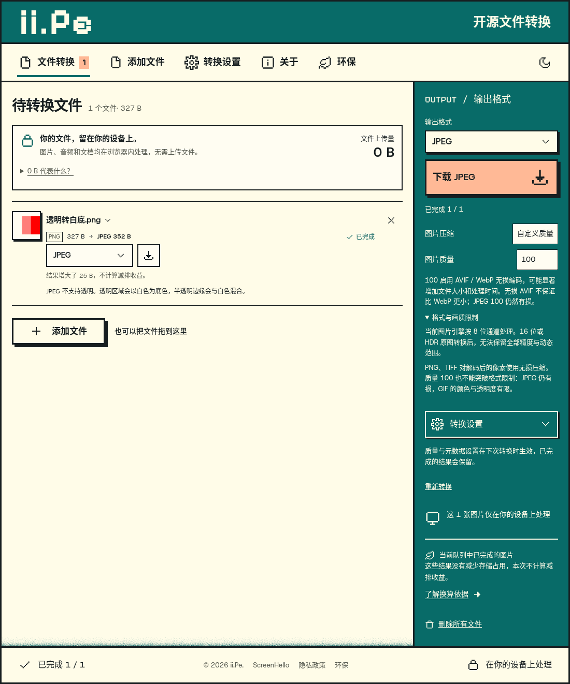
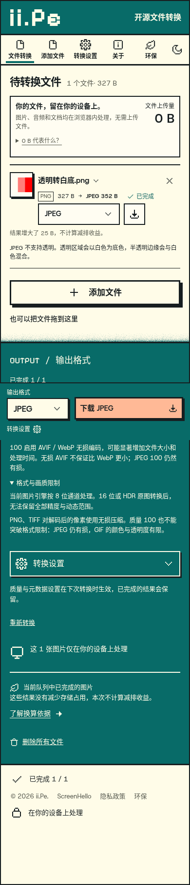

# 图片保真与压缩验证

2026-09-07，Node 22.22.2、Chromium 149、magick-wasm 0.0.43（Q8）。

| 报告                                      | 内容                                                               |
| ----------------------------------------- | ------------------------------------------------------------------ |
| [用户样本](user-sample-results.json)      | 同一张 PNG 在本轮修复前后的 6 格式体积、耗时、位深、8 位像素一致性 |
| [合成探针：修复前](synthetic-before.json) | 位深、方向、alpha、TIFF 压缩、ICC 删除的原行为                     |
| [合成探针：修复后](synthetic-after.json)  | 同组输入经过共享编码路径修复后的结果                               |
| [开发浏览器](development-results.json)    | 7 组真实转换、下载、像素与 ICC 检查、Chromium 显示色彩对照         |
| [生产浏览器](production-results.json)     | 与开发环境相同的端到端检查                                         |
| [PDF 格式矩阵](pdf-format-results.json)   | 23 格式的单页下载、多页 ZIP、实际解码和页序                        |
| [原有工作区](workspace-results.json)      | 原有 HEIC、取消/重试、批量下载与界面回归                           |

合成探针 ICC 部分使用系统 Adobe RGB/sRGB 配置作为独立参照；修复后的内嵌标准 sRGB 与系统曲线有少量取整差异，最大通道差为 1。正式回归测试使用已归档的 CC0 Display P3 配置，并额外以浏览器颜色管理交叉验证。

全部 146 项 Node 测试通过，包含本轮新增 40 项。实现、问题与限制见[审查记录](../image-output-fidelity.md)。

下列截图只包含运行时生成的合成图，不包含用户原图。

| 桌面                                  | 手机                                 |
| ------------------------------------- | ------------------------------------ |
|  |  |
