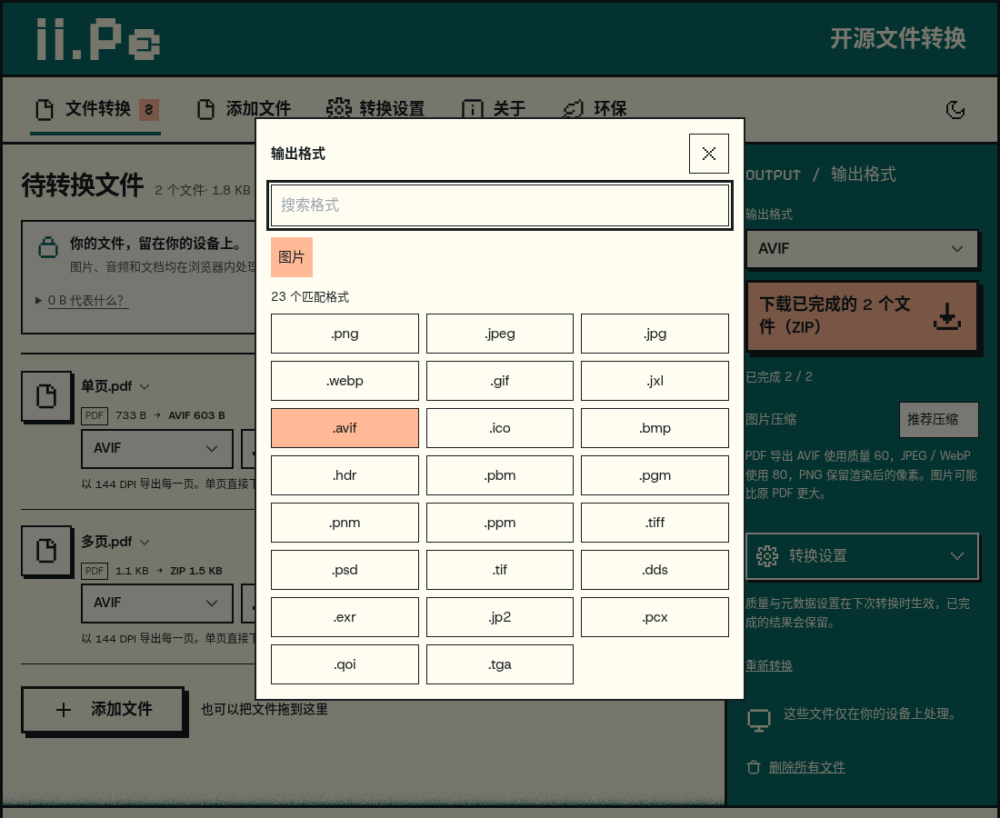
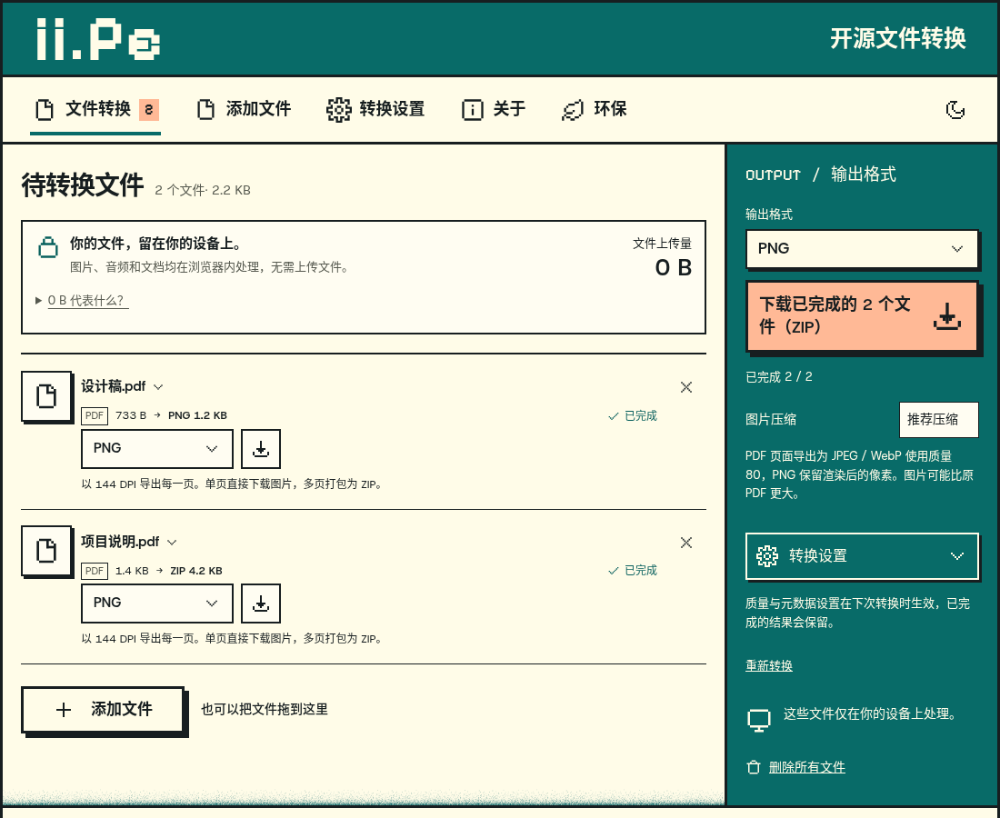
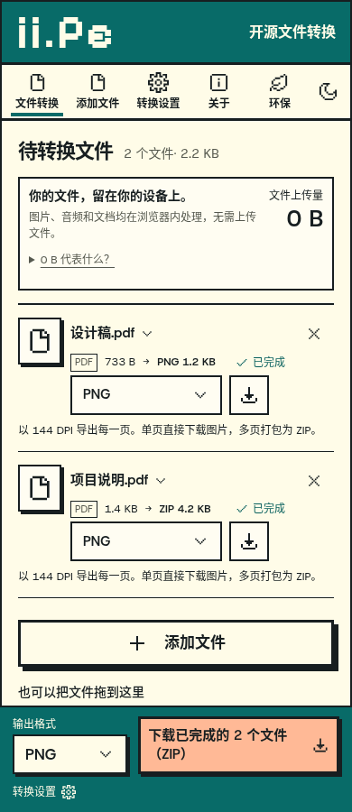
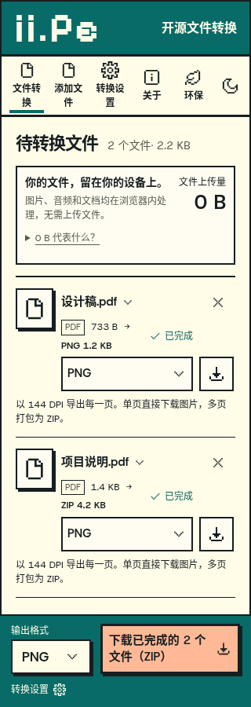

# PDF 转图片验证记录

2026-09-07，Node 22.22.2、Chromium 149、MuPDF 1.28.1、ImageMagick WASM 0.0.43。

PDF 测试输入由 `tests/helpers-pdf-fixture.mjs` 生成，不含用户文件。脚本及断言见 `tests/pdf-images.test.mjs`、`tests/pdf-image-formats.test.mjs`、`tests/browser/pdf-images.mjs`、`tests/browser/pdf-format-matrix.mjs` 和 `tests/browser/pdf-load-retry.mjs`。

- 全部 106 项 Node 测试通过。
- 开发和生产环境逐一验证 23 个扩展名：实际单页下载、多页 ZIP 下载、解码后的尺寸、颜色与页序。
- 开发和生产环境均通过真实转换与下载、格式与页序、取消和重试、五类错误恢复、普通图片转换回归、手机宽度和本地请求边界验证。
- 生产环境进一步验证多页 PDF 已完成至少一页 AVIF 编码后取消，后续排队 PDF 正常完成。
- 生产环境原有 `tests/browser/workspace.mjs` 回归通过。
- 分别阻断 MuPDF 与 ImageMagick WASM 下载，均能显示失败，解除阻断后同一文件重试成功。
- 格式弹窗延迟关闭事件的焦点回归测试：修复前稳定失败，修复后开发和生产模式通过。
- Svelte 检查 0 错误 / 0 警告，ESLint 与生产构建通过。

报告：[生产流程](production-results.json)、[开发流程](development-results.json)、[生产格式矩阵](format-matrix-production.json)、[开发格式矩阵](format-matrix-development.json)、[原有工作区回归](workspace-results.json)、[MuPDF 下载重试](load-retry-results.json)、[图片编码器下载重试](encoder-load-retry-results.json)、[弹窗焦点](format-focus-results.json)。

新增格式与 AVIF 多页输出：

| 23 个格式选项                    | AVIF 转换结果                |
| -------------------------------- | ---------------------------- |
|  |  |

以下保留首版的响应式截图：一个单页 PDF、一个三页 PDF，均已完成转换。本轮另通过 320/390/1100 px 的溢出检查。

| 桌面 1100 px                   | 手机 390 px                     | 手机 320 px                     |
| ------------------------------ | ------------------------------- | ------------------------------- |
|  |  |  |
