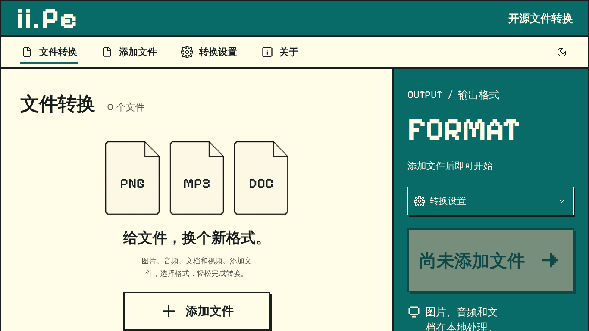
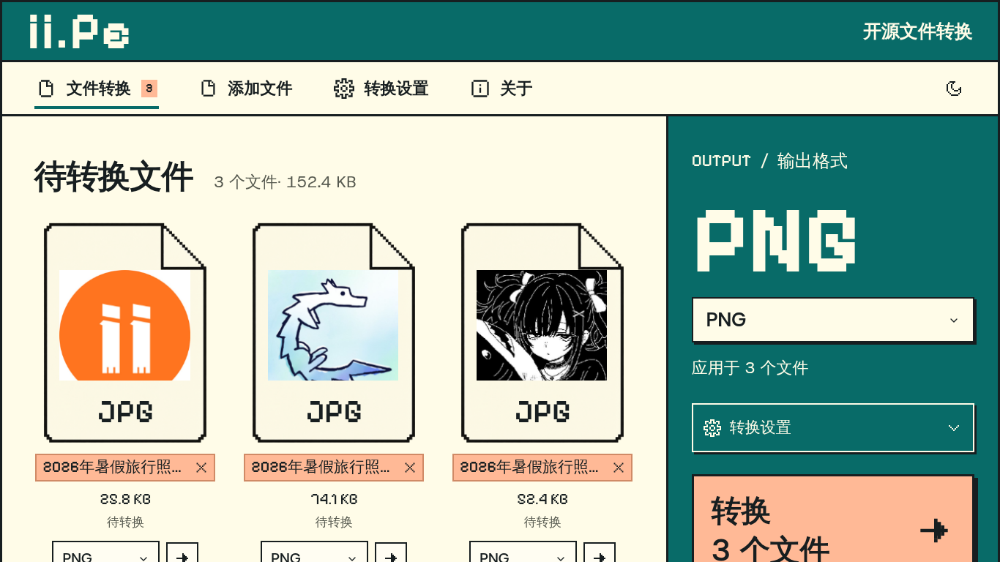
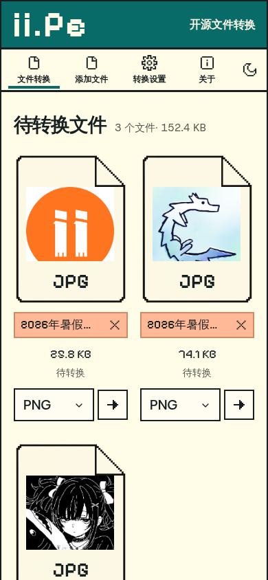
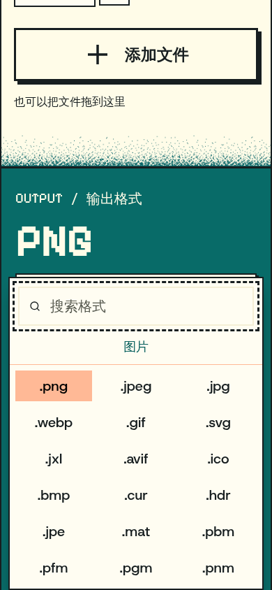
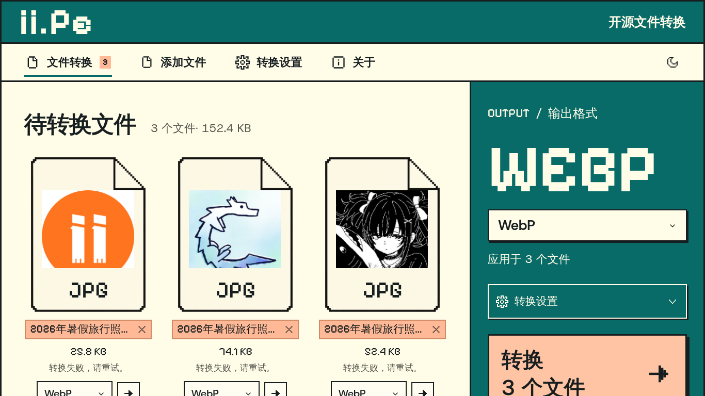
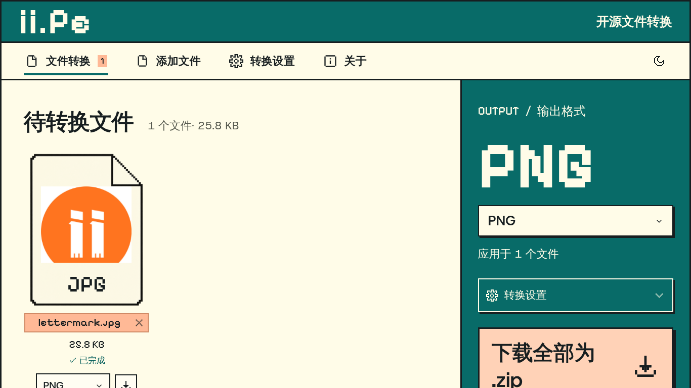

# ii.Pe 界面与体验审查

2026-09-06，本次重新访问本地预览并截图。范围：中文、1366×768 桌面、390×844 手机、添加文件 → 选择格式 → 转换/下载。没有修改应用界面代码。

## 判断

保留墨绿、奶油白、桃色和像素图标。下一轮应提高操作可见性与文件信息可读性，减少纸张装饰和重复格式展示占用的空间。

## 优先建议

| 优先级 | 证据 | 问题                                                      | 建议                                                                          |
| ------ | ---- | --------------------------------------------------------- | ----------------------------------------------------------------------------- |
| 高     | 3    | 3 个文件时手机转换按钮位于页面约 1641px，844px 首屏不可见 | 底部固定格式/转换栏，文件区独立滚动并预留安全间距                             |
| 高     | 1、2 | 大纸张、FORMAT/PNG 重复展示及超大按钮挤占首屏             | 缩小装饰，采用紧凑文件列表；桌面常用高度完整显示主操作                        |
| 高     | 2、3 | 同前缀长文件名几乎一样，手机文件名仅有 117px 可见宽       | 文件名用普通界面字体，两行显示或中间省略，保留结尾及扩展名；可展开完整名称    |
| 中     | 4    | 扩展名选项多且没有用途说明                                | 常用格式独立分组，补充简短用途说明，其余折叠；手机菜单加明确关闭入口          |
| 中     | 5    | 失败只提示重试，页脚仍为准备就绪                          | 区分引擎初始化失败/文件问题，统一总体状态；给出重试失败项和具体恢复操作       |
| 中     | 6    | 单文件仍以 ZIP 下载为主按钮；只展示原体积                 | 单文件主按钮直接下载结果，多文件再打包；显示输出大小、体积变化与输入→输出格式 |

## 本次流程和截图

1. 桌面首页：入口明确，首屏空间使用需优化。

2. 桌面添加文件：批量设置可用；长文件名识别性较差。

3. 手机添加文件：没有横向溢出，主操作距离文件过远。

4. 手机格式选择：搜索有效，选项高度为 44px；格式说明与关闭入口不足。

5. 转换失败状态：错误可见，但缺少原因和一致的总体状态。

6. 生产构建单文件完成：转换成功，下载主次和结果信息需要优化。

## 边界

本次采用真实图片，生产构建 JPG 转 PNG 成功。开发预览发现 ImageMagick 旧依赖缓存：source map 内源代码与已安装包不一致（362992 对 409198 字符），触发 WebAssembly LinkError；已用 --force 重启开发服务器，最终复验结果另见 verification.json。

触屏完整文件名、图标操作说明值得加强。DOM 中每个上传入口同时出现文件 input 和可见按钮；input 已设置 tabindex=-1，但仍需用真实读屏器验证是否重复播报。本次没有执行完整读屏、键盘导航、对比度量测或全格式兼容测试，不宣称完整无障碍合规。未评估视频服务器上传体验。
